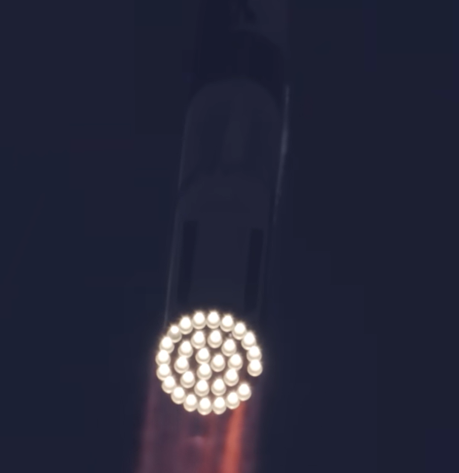
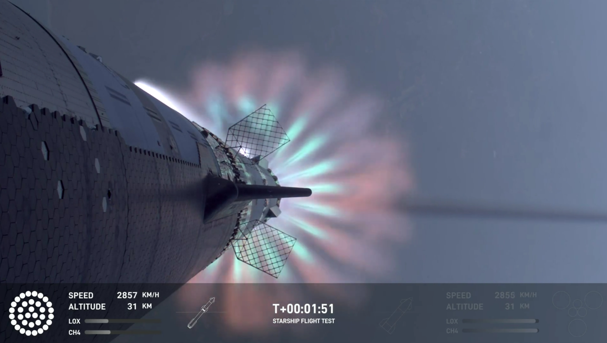
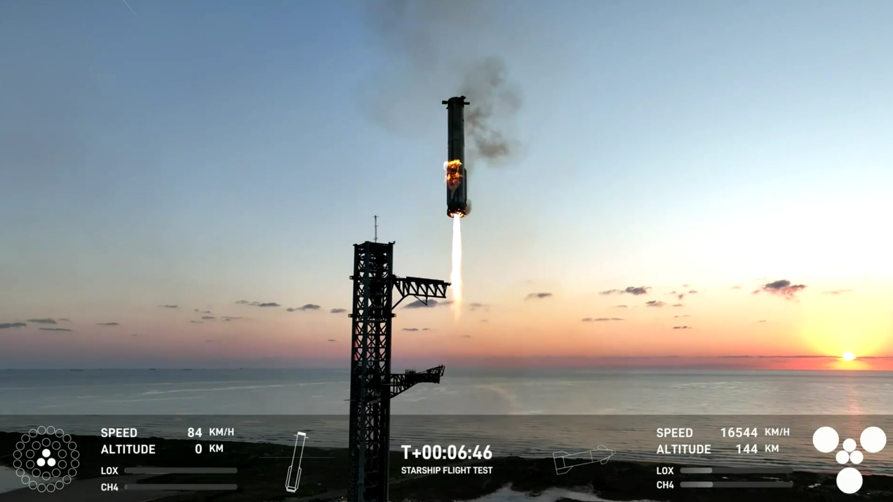
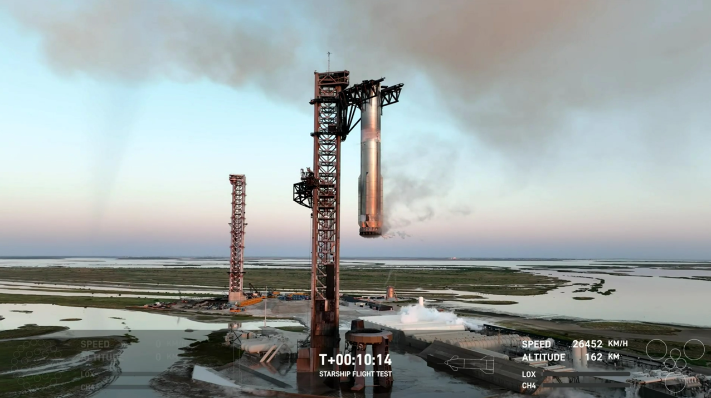
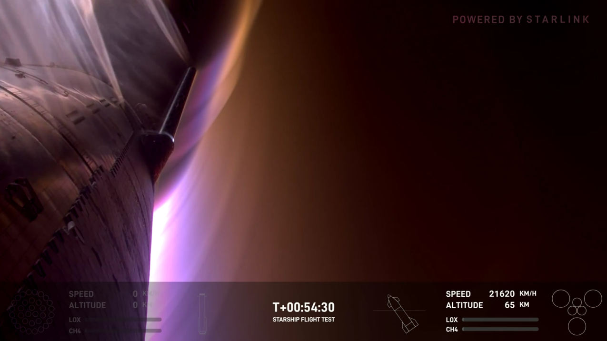
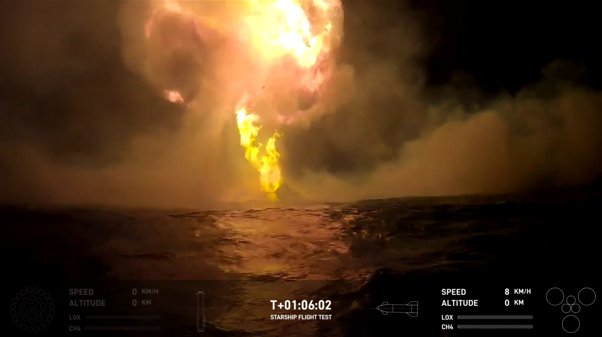

### Starship Flight 1 (20. April 2023)

](images/Starship5_000004.png)

::: {.callout-note}
## "Successful miss" SpaceX's Starship (Dauer 20 min)
**Aufgabe:**

**a)** Sehen Sie sich das Video des ersten Orbitaltestflugs von SpaceX's Starship am 20. April 2023 vom Start bis zum [Rapid Unscheduled Disassembly](https://en.wiktionary.org/wiki/rapid_unplanned_disassembly) (RUD) an! Viel Spaß! (Dauer 5 Minuten).

**b)** Diskutieren Sie in Ihrer Gruppe, ob der erste Orbitaltestflug von SpaceX's Starship ein Erfolg oder ein Misserfolg war!

Vorgaben:

+ Finden Sie sich in Zweiergruppen zusammen (bei ungerader Anzahl an Teilnehmenden bitte neben den Zweiergruppen auch eine Dreiergruppe bilden).
+ Nehmen Sie hierzu je Person in der Gruppe eine der zwei Positionen (1.)Flug war ein Erfolg xoder 2.) Flug war ein Misserfolg) ein und versuchen Sie sich gegenseitig davon zu überzeugen, dass der Flug ein Misserfolg/ein Erfolg war.
+ Nehmen Sie sich hierfür insgesamt 10 Minuten Zeit.

**c)** Überlegen Sie bitte kurz: Woran machen Sie Ihre Einschätzung fest? Welches sind die aus Ihrer Sicht relevanten Argumente/Kriterien, die letztlich zu Ihrer Entscheidung führen? Bitte Fragen Sie sich hierzu: Würden wir mit einer Bewertungsmatrix arbeiten wären das dann auch die Kriterien, die in einer Bewertungsmatrix Verwendung finden würden!? Bitte notieren Sie sich die aus Ihrer Sicht wichtigen Argumente/Kriterien für eine nachfolgende Sammlung der Kriterien im Plenum!

Vorgaben:

+ Bitte nehmen Sie sich hierfür nochmals 5 Minuten Zeit. 

**d)** **HAUSAUFGABE**: was waren die Testziele der Starship Flüge 2-11 ? Wie wurden diese gemessen und wurden Sie erreicht? Fertigen Sie eine Tabelle  an. Recherchieren Sie diese Informationen durch Beobachtung der Videos (Youtube SpaceX), Wikipedia und weitere Werkzeuge (Begriffserklärungen siehe @sec-gloss).

:::

<!--
Diskutieren Sie in Ihrer Gruppe, auf welcher Grundlage, vor dem Hintergrund welcher Erwartungshaltung, aus welcher Rolle im Projekt Starship heraus Sie Ihre Einschätzung gefunden haben!
-->

> *"With a test like this, success comes from what we learn, and we learned a tremendous amount about the vehicle and ground systems today that will help us improve on future flights of Starship."* (Quelle: [SpaceX](https://www.spacex.com/launches/mission/?missionId=starship-flight-test#:~:text=April%2020,%202023.%20Starship%20Flight%20Test.%20SpaceX%20designs,%20manufactures%20and))

<!--
### Update: Starship Flight 1 (20. April 2023)


-->

<!--
### Update: Starship Flight 2 (18. November 2023)


-->

<!-- -------------------------------------------------------------------------

                       Starship Flight 4 (6. Juni 2024)

-------------------------------------------------------------------------- -->

### Update: Starship Flight 4 (6. Juni 2024)

<!-- -------------------------------------------------------------------------

                       Starship Flight 5 (13. Oktober 2024)

-------------------------------------------------------------------------- -->

### Update: Starship Flight 5 (13. Oktober 2024)

> *"Rapid, iterative approach"* (Quelle: SpaceX)

> *"The payload of today's mission is the data we get."* (Quelle: SpaceX)

## nützliche Begriffe / Abkürzungen {#sec-gloss}

| Begriff / Abkürzung | Deutsch / Ausgeschrieben | Kurze Definition |
|---------------------|---------------------------|------------------|
| Ablative Layer | Abtragende Schutzschicht | Material, das beim Wiedereintritt kontrolliert verbrennt und Hitze ableitet. |
| Actuators | Aktuatoren | Stellmotoren zur Bewegung von Flaps und anderen Steuerflächen. |
| Aerodynamics | Aerodynamik | Verhalten eines Flugkörpers in der Luftströmung. |
| AoA – Angle of Attack | Anstellwinkel | Winkel zwischen Fahrzeugausrichtung und Luftströmung. |
| Apogee | Apogäum | Höchster Punkt der Flugbahn. |
| Attitude Control | Lagekontrolle | Steuerung der Ausrichtung des Raumfahrzeugs. |
| Avionics | Bordelektronik | Elektronische Systeme für Navigation, Steuerung und Kommunikation. |
| Block-1 / Block-2 / Block-3 | Versionsblock | Entwicklungsstufen des Starship mit technischen Verbesserungen. |
| Booster | Erststufe | Untere Stufe, die den Hauptschub beim Start liefert. |
| Boostback | Rückbrennmanöver | Manöver, das den Booster zurück zum Startgebiet lenkt. |
| Burn | Brennphase | Zeitraum, in dem ein Triebwerk aktiv brennt. |
| Catch Attempt | Fangversuch | Versuch, den Booster mit dem Tower einzufangen. |
| Data Collection | Datensammlung | Erfassen technischer Messwerte während des Flugs. |
| Deployment | Aussetzen | Freigabe von Satelliten im All. |
| Dummy Sats | Dummy-Satelliten | Nutzlast-Attrappen ohne Funktion. |
| Engine-Out | Triebwerksausfall | Weiterflug trotz eines ausgefallenen Triebwerks. |
| Engine Plume | Triebwerksstrahl | Ausstoßgas des Triebwerksstrahls. |
| Engine Section | Triebwerkssektion | Unterer Bereich des Ships mit den Raptor-Triebwerken. |
| FTS – Flight Termination System | Flugabbruchsystem | Sicherheitssystem, das die Rakete im Notfall zerstört. |
| Flaps | Steuerklappen | Bewegliche Klappen zur Fluglagenkontrolle. |
| Full-Duration Burn | Vollständige Brennphase | Triebwerkslauf bis zur geplanten Abschaltung. |
| Guidance | Flugführung | Algorithmische Steuerung der Bahn und Orientierung. |
| Hang Time | Freiflugzeit | Zeit ohne aktive Triebwerkszündung. |
| Heat Shield | Hitzeschild | Schutzsystem für den Wiedereintritt. |
| Hot-Staging | Heißstufentrennung | Oberstufe zündet, während sie noch am Booster hängt. |
| Landing Burn | Landezündung | Triebwerkszündung kurz vor der Landung. |
| Leak | Leck | Austritt von Treibstoff oder Gas. |
| LOX – Liquid Oxygen | Flüssigsauerstoff | Oxidator für die Raptor-Triebwerke. |
| Mechazilla | Fangturm | Turm mit Fangarmen für Booster-Landungen. |
| Mission Duration | Missionsdauer | Gesamtdauer des Fluges. |
| Off-Target | Zielabweichung | Entfernung vom geplanten Landepunkt. |
| Outgassing | Entgasung | Gasfreisetzung aus Tanks oder Struktur. |
| Out-of-Family | außerhalb der Norm | Ungewöhnlicher technischer Messwert. |
| Passivation | Passivierung | Sicheres Entleeren/Abschalten vor dem Verglühen. |
| Peak Heating | Hitze-Maximum | Wärmestärkste Phase des Wiedereintritts. |
| Perigee | erdnächster Punkt | Niedrigster Punkt der Flugbahn. |
| Raptor (Engine) | Raptor-Triebwerk | Methalox-Triebwerk von SpaceX. |
| Reentry | Wiedereintritt | Phase, in der das Raumfahrzeug wieder in die Atmosphäre eintritt. |
| Relight | Wiederzündung | Neustart eines Triebwerks im Weltraum. |
| RUD – Rapid Unscheduled Disassembly | Explosion / Auseinanderbrechen | Ironische Bezeichnung für zerstörerisches Zerbrechen. |
| Shakedown Flight | Erprobungsflug | Testflug zur vollständigen Systemüberprüfung. |
| Sim Load / Loads | Strukturlasten | Mechanische Belastungen auf Struktur und Triebwerke. |
| Soft Landing | weiche Landung | Geringe Aufprallgeschwindigkeit bei Landung. |
| Splashdown | Wasserlandung | Landung im Ozean. |
| Stack | Gesamtrakete | Kombination aus Booster und Ship. |
| Stage Separation | Stufentrennung | Trennen von Booster und Ship im Flug. |
| Starlink Dispenser Door | Aussetzklappe | Tür zum Aussetzen von Starlink-Satelliten. |
| Telemetry | Telemetrie | Ferndatenübertragung zur Bodenstation. |
| Thermal Protection System – TPS | Hitzeschutzsystem | Schutz gegen extreme Reentry-Temperaturen. |
| Tiles | Kacheln | Keramikplatten als Hitzeschutz. |
| Tower Catch | Tower-Fang | Booster wird im Flug vom Turm gefangen. |
| Trajectory | Flugbahn | Geplante Bewegung des Raumfahrzeugs. |
| Thrusters | Steuerdüsen | Kleine Düsen zur Feinsteuerung. |
| Thrust | Schub | Kraft des Triebwerks. |
| Vehicle | Raumfahrzeug | Allgemeine Bezeichnung für Rakete oder Ship. |
| Virtual Tower Landing | Virtuelle Turmlandung | Simulierter Fang ohne physischen Tower-Kontakt. |
: **Komplette Tabelle aller englischen Begriffe & Abkürzungen – Starship Testflüge** {#tbl-sarship-abr .striped .hover .bordered tbl-colwidths="[20,10,70]"}