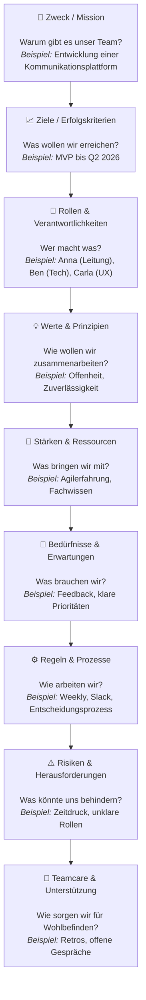
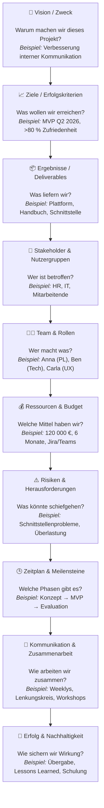

---
format:
  html:
    embed-resources: true
lang: de
bibliography: Literatur.bib
---

<!--
headlines:
  off: true
extended-content:
  off: false
included-content:
  off: false
worksheets:
  off: true
-->

<!--
title: "DEB Produktentwicklung"
format:
  html:
    embed-resources: true

author:
  - name: "Christian Anders"
    degrees: 
    roles: "Dozent"
    email: christian.anders@hs-esslingen.de
    affiliation: 
      - name: "Hochschule Esslingen"
        department: "Wirtschaft & Technik"
        group: "Digital Engineering (DEB)"
        city: "Esslingen am Neckar"
        postal-code: 73728
        country: "Deutschland"
        url: https://www.hs-esslingen.de/
abstract: > 
  Skript zur Vorlesung und Labor *"Produktentwicklung"* für den Studiengang Digital Engineering DEB
keywords:
  - Chi-Quadrat-Test
  
copyright: 
  holder: Christian Anders
  year: 2025
lang: de
bibliography: Literatur.bib
date: last-modified
toc: true
number-sections: true
scrollable: true
toc-location: right
cap-location: bottom
number-offset: 2
link-external-icon: true
link-external-newwindow: true
-->

<!--
number-offset: 
0 Grundlagen
1 Ideenfindung und Konzeptentwicklung
2 Entwurfs- und Entwicklungsphase
3 Prototyping und Test
4 Produktionsplanung und Produktion
5 Softskills
6 Literatur 
7 Anhang
-->

::: {.content-visible unless-meta="headlines.off"}
# Grundlagen
## Statistik und Stochastik
:::

<!-- -------------------------------------------------------------------------

                       Callout !!! WARNING !!!

------------------------------------------------------------------------------ 

::: {.callout-warning}
## WARNING!
**THIS CHAPTER IS STILL WORK IN PROGRESS!!!**
:::

-------------------------------------------------------------------------- -->

<!-- -------------------------------------------------------------------------

                       Canvas

-------------------------------------------------------------------------- -->

### Canvas {#sec-canvas}

::: {.callout-tip}
## Definition *"Canvas"*
Im Projektmanagement ist ein Canvas ein visuelles Rahmenwerk, das sämtliche zentralen Projektparameter (z. B. Zweck, Stakeholder, Ergebnisse, Zeitrahmen, Risiken) auf einer einzigen, strukturierten Fläche abbildet. Es dient dazu, interdisziplinären Projektteams ein gemeinsames Verständnis zu ermöglichen, Kommunikationslücken zu vermindern und den Projektstart , die Steuerung sowie Retrospektiven zu unterstützen.
:::

---

## 🧭 **Definition: Canvas im Projektmanagement**

Ein **Canvas** ist ein **visuelles, strukturiertes Arbeits- und Kommunikationswerkzeug**, das komplexe Sachverhalte eines Projekts **auf einer einzigen Seite übersichtlich darstellt**.
Es dient dazu, **Ziele, Zusammenhänge und Verantwortlichkeiten** eines Projekts oder Teams **gemeinsam zu verstehen, zu planen und zu reflektieren**.

---

## 🔹 **Kernmerkmale eines Canvas**

1. **Visualisierung:**
   Informationen werden in klar abgegrenzten Feldern (z. B. „Ziele“, „Stakeholder“, „Ressourcen“) visualisiert.
   → erleichtert den Überblick und die gemeinsame Diskussion.

2. **Struktur:**
   Das Canvas bietet eine **einheitliche Vorlage** mit festen Themenbereichen, die die wichtigsten Dimensionen eines Projekts abdecken.

3. **Kollaboration:**
   Es wird **gemeinsam im Team oder mit Stakeholdern** ausgefüllt — das Ziel ist **kollektives Verständnis, nicht Dokumentation um der Dokumentation willen**.

4. **Einfachheit und Fokus:**
   Alle relevanten Aspekte passen **auf eine Seite**; so wird Fokus auf das Wesentliche gelegt.

5. **Iterativ und lebendig:**
   Ein Canvas ist **kein statisches Dokument**, sondern wird im Projektverlauf **weiterentwickelt und aktualisiert**.

---

## 🔹 **Funktion und Nutzen im Projektmanagement**

| **Funktion**                  | **Nutzen**                                                               |
| ----------------------------- | ------------------------------------------------------------------------ |
| **Projektdefinition**         | Klärt Vision, Ziel, Nutzen und Umfang zu Beginn.                         |
| **Teamalignment**             | Fördert gemeinsames Verständnis und Abstimmung im Team.                  |
| **Stakeholder-Kommunikation** | Dient als klar verständliches Kommunikationsinstrument.                  |
| **Agilität & Transparenz**    | Unterstützt iterative Planung und schnelles Reagieren auf Veränderungen. |
| **Reflexion & Lernen**        | Grundlage für Retrospektiven und Lessons Learned.                        |

---

## 🔹 **Beispiele für Canvas-Formate im Projektmanagement**

| **Canvas-Typ**            | **Fokus**                                          | **Typische Anwendung**             |
| ------------------------- | -------------------------------------------------- | ---------------------------------- |
| **Project Canvas**        | Projektstruktur, Ziele, Risiken, Stakeholder       | Projektinitiierung, Kick-off       |
| **Team Canvas**           | Zusammenarbeit, Rollen, Werte                      | Teamentwicklung, Teamcare          |
| **Business Model Canvas** | Geschäftsmodell und Nutzenlogik                    | Innovationsprojekte, Strategie     |
| **Lean Canvas**           | Hypothesenorientiertes Projekt- oder Produktdesign | Frühphase von Innovationsprojekten |

---

## 💬 **Kurzdefinition**

> **Ein Canvas im Projektmanagement ist eine visuelle Arbeitsvorlage, die alle wesentlichen Elemente eines Projekts oder Teams auf einer Seite strukturiert abbildet, um gemeinsame Klarheit, Kommunikation und Steuerung zu fördern.**

---

Möchtest du, dass ich dir eine kurze, zitierfähige **wissenschaftliche Definition** (z. B. für ein Paper oder Bericht) formuliere, basierend auf Literaturquellen zu Canvas-Methoden im Projektmanagement?

Perfekt — der **Team Canvas** ist ein hervorragendes Werkzeug, um in Projektteams **Verständnis, Vertrauen und gemeinsame Ausrichtung** zu schaffen, besonders bei neu gebildeten oder interdisziplinären Teams.

Hier ist ein Beispiel für einen vollständigen **Team Canvas**, das du z. B. in einem Kick-off-Workshop nutzen kannst.

---

## 🧩 **Beispiel: Team Canvas (Projektteam)**

| **Bereich**                            | **Beschreibung / Leitfragen**                                            | **Beispielhafte Inhalte**                                                                               |
| -------------------------------------- | ------------------------------------------------------------------------ | ------------------------------------------------------------------------------------------------------- |
| **1. Zweck / Mission**                 | Warum gibt es dieses Team? Welchen Beitrag leisten wir?                  | „Wir entwickeln eine nutzerfreundliche Plattform, die interne Kommunikationsprozesse beschleunigt.“     |
| **2. Ziele / Erfolgskriterien**        | Welche konkreten Ergebnisse wollen wir erreichen? Wie messen wir Erfolg? | „MVP bis Q2 2026 fertigstellen“, „>80 % Zufriedenheit im internen Feedback“                             |
| **3. Rollen & Verantwortlichkeiten**   | Wer ist für was zuständig? Wer trifft Entscheidungen?                    | Projektleitung: Anna Technik: Ben UX/UI: Carla Kommunikation: David                            |
| **4. Werte & Prinzipien**              | Was ist uns im Miteinander wichtig?                                      | Offenheit, Zuverlässigkeit, Lernorientierung, Transparenz                                               |
| **5. Stärken & Ressourcen**            | Was bringt jede*r mit? Welche Kompetenzen oder Ressourcen haben wir?     | Technisches Know-how, Erfahrung im agilen Arbeiten, gute Stakeholder-Beziehungen                        |
| **6. Bedürfnisse & Erwartungen**       | Was brauchen wir, um gut arbeiten zu können?                             | Regelmäßiges Feedback, klare Prioritäten, psychologische Sicherheit                                     |
| **7. Regeln & Prozesse**               | Wie organisieren wir Zusammenarbeit, Kommunikation und Entscheidungen?   | Weekly Check-in (Mo), Slack für Austausch, Entscheidungsregeln: „Beraten → Entscheiden → Kommunizieren“ |
| **8. Risiken & Herausforderungen**     | Was könnte unsere Zusammenarbeit erschweren?                             | Zeitdruck, unklare Rollen, parallele Projekte                                                           |
| **9. Unterstützungsbedarf / Teamcare** | Wie achten wir auf Wohlbefinden und Belastung?                           | Regelmäßige Stimmungabfragen, offenes Ansprechen von Überlastung, monatliche Retrospektive              |

---

## 🧭 Visualisierung als **Mermaid-Canvas** (z. B. für Quarto oder Markdown)

---

## 💬 Anwendungshinweis

* Der **Team Canvas** ist **kein statisches Dokument**, sondern ein **Dialoginstrument**.
* Optimalerweise wird er **gemeinsam im Team-Workshop** erarbeitet (z. B. auf Miro, Mural oder Whiteboard).
* Nach etwa **4–6 Wochen Projektdauer** lohnt sich eine **Reflexion oder Aktualisierung**: Was hat sich verändert? Was braucht das Team jetzt?

---

Gerne — der **Project Canvas** ist sozusagen das „Einseiter-Strategie-Board“ für Projekte:
Er bringt alle wesentlichen Elemente – Ziele, Stakeholder, Deliverables, Risiken, Ressourcen usw. – **auf einen Blick** zusammen.

Hier ein vollständiges Beispiel mit Beschreibung, Beispielinhalten und einer Mermaid-Visualisierung, passend zu einer klaren und professionellen Projektkommunikation.

---

## 🧭 **Beispiel: Project Canvas (Softwareentwicklungsprojekt)**

| **Bereich**                           | **Leitfragen**                                                          | **Beispielhafte Inhalte**                                                                                     |
| ------------------------------------- | ----------------------------------------------------------------------- | ------------------------------------------------------------------------------------------------------------- |
| **1. Vision / Zweck**                 | Warum existiert das Projekt? Welchen übergeordneten Beitrag leistet es? | „Digitale Plattform zur Verbesserung der internen Kommunikation zwischen Teams und Führungskräften.“          |
| **2. Ziele / Erfolgskriterien**       | Was wollen wir konkret erreichen, und woran erkennen wir Erfolg?        | „MVP bis Q2 2026“, „>80 % Nutzerzufriedenheit im internen Pilot“, „Verkürzung der Kommunikationswege um 30 %“ |
| **3. Ergebnisse / Deliverables**      | Was liefert das Projekt konkret ab?                                     | „Plattform-Prototyp“, „Nutzerhandbuch“, „Trainingsmaterial“, „Datenschnittstelle zum HR-System“               |
| **4. Stakeholder & Nutzergruppen**    | Wer ist betroffen, beteiligt oder beeinflusst das Projekt?              | Hauptnutzer: interne Mitarbeitende Stakeholder: HR, IT, Kommunikation, Betriebsrat                         |
| **5. Team & Rollen**                  | Wer arbeitet am Projekt mit, und in welchen Funktionen?                 | Projektleitung: Anna Technik: Ben UX: Carla Kommunikation: David Support: Eva                     |
| **6. Ressourcen & Budget**            | Welche Mittel stehen zur Verfügung (Zeit, Geld, Infrastruktur)?         | Budget: 120 000 € Zeitrahmen: 6 Monate Tools: Jira, Confluence, Teams                                   |
| **7. Risiken & Herausforderungen**    | Was könnte den Projekterfolg gefährden?                                 | „Verzögerungen durch Schnittstellenprobleme“, „Überlastung im Kernteam“, „Stakeholderkonflikte“               |
| **8. Zeitplan & Meilensteine**        | Was sind die wichtigsten Phasen oder Meilensteine?                      | M1: Konzeptfreigabe (Jan 2026) M2: MVP-Release (Apr 2026) M3: Evaluation (Jun 2026)                     |
| **9. Kommunikation & Zusammenarbeit** | Wie und wann tauschen wir uns aus?                                      | Weekly Sync, monatlicher Lenkungskreis, Feedback-Workshops mit Nutzern                                        |
| **10. Erfolg & Nachhaltigkeit**       | Wie stellen wir sicher, dass Ergebnisse weiterwirken?                   | Übergabe an IT-Betrieb, Lessons Learned-Dokumentation, interne Schulung                                       |

---

## 🗺️ **Visualisierung als Project Canvas (Mermaid)**

---

## 💡 **Anwendung in der Praxis**

* Der **Project Canvas** eignet sich ideal für **Projektstart, Kick-off oder Neuausrichtung**.
* Er kann in **Workshops mit Stakeholdern** ausgefüllt werden, um Konsens über Ziele und Rahmenbedingungen zu schaffen.
* Im Projektverlauf kann er **fortgeschrieben oder versioniert** werden (z. B. „Project Canvas v1.2“ nach Lenkungskreis).
* Besonders wirkungsvoll ist die Kombination mit dem **Team Canvas**, um neben den Strukturen auch die **menschliche Dynamik** im Projekt zu berücksichtigen.

---

Möchtest du, dass ich dir den **Project Canvas** als **Markdown-Template** oder als **druckfertiges PDF** mit Platz für Eingaben erstelle (z. B. zur Nutzung in Workshops oder Dokumentationen)?

# 🧭 Project Canvas

## 🎯 1. Vision / Zweck
> **Warum gibt es dieses Projekt?**
>
> (Beschreibe den übergeordneten Zweck oder den Beitrag des Projekts zur Gesamtstrategie.)
>
> **Beispiel:**  
> „Wir entwickeln eine digitale Plattform, um interne Kommunikationsprozesse zwischen Teams und Führungskräften zu verbessern.“

---

## 📈 2. Ziele / Erfolgskriterien
> **Was wollen wir erreichen und woran erkennen wir Erfolg?**
>
> (Formuliere messbare Ziele und Erfolgskriterien, z. B. KPIs oder Zielzustände.)
>
> - MVP bis Q2 2026 fertigstellen  
> - >80 % Nutzerzufriedenheit im Pilotversuch  
> - Kommunikationswege um 30 % verkürzen  

---

## 📦 3. Ergebnisse / Deliverables
> **Welche konkreten Ergebnisse liefert das Projekt?**
>
> (Z. B. Produkte, Dokumente, Prozesse oder Services.)
>
> - Plattform-Prototyp  
> - Nutzerhandbuch  
> - Trainingsmaterial  
> - Datenschnittstelle zum HR-System  

---

## 👥 4. Stakeholder & Nutzergruppen
> **Wer ist betroffen, beteiligt oder beeinflusst das Projekt?**
>
> (Liste wichtige Stakeholder, Zielgruppen oder Nutzer.)
>
> - Hauptnutzer: interne Mitarbeitende  
> - Stakeholder: HR, IT, Kommunikation, Betriebsrat  

---

## 🧑‍💻 5. Team & Rollen
> **Wer arbeitet am Projekt mit und in welcher Rolle?**
>
> (Führe alle Teammitglieder mit Hauptverantwortung auf.)
>
> - Anna – Projektleitung  
> - Ben – Technik  
> - Carla – UX/UI  
> - David – Kommunikation  
> - Eva – Support  

---

## 💰 6. Ressourcen & Budget
> **Welche Mittel stehen zur Verfügung?**
>
> (Zeit, Geld, Tools, Infrastruktur.)
>
> - Budget: 120 000 €  
> - Zeitraum: 6 Monate  
> - Tools: Jira, Confluence, Teams  

---

## ⚠️ 7. Risiken & Herausforderungen
> **Was könnte den Projekterfolg gefährden?**
>
> (Identifiziere Risiken und mögliche Gegenmaßnahmen.)
>
> - Verzögerungen durch Schnittstellenprobleme  
> - Überlastung im Kernteam  
> - Stakeholderkonflikte  

---

## 🕒 8. Zeitplan & Meilensteine
> **Welche Phasen oder Meilensteine gibt es?**
>
> - M1: Konzeptfreigabe – Januar 2026  
> - M2: MVP-Release – April 2026  
> - M3: Evaluation – Juni 2026  

---

## 💬 9. Kommunikation & Zusammenarbeit
> **Wie und wann tauschen wir uns aus?**
>
> - Weekly Sync (Montag, 9 Uhr)  
> - Monatlicher Lenkungskreis  
> - Feedback-Workshops mit Nutzergruppen  

---

## 🏁 10. Erfolg & Nachhaltigkeit
> **Wie stellen wir sicher, dass die Ergebnisse weiterwirken?**
>
> (Was passiert nach Projektende? Wer übernimmt Ergebnisse?)
>
> - Übergabe an IT-Betrieb  
> - Lessons-Learned-Dokumentation  
> - Schulung der Endnutzer  

---

## 🧩 Hinweise zur Nutzung
- 💡 Am besten **gemeinsam im Kick-off-Workshop** ausfüllen (z. B. auf Miro, Mural oder Whiteboard).  
- 🔁 Regelmäßig **aktualisieren** (z. B. bei größeren Änderungen oder Review-Terminen).  
- 🗂️ Versionieren: *Project Canvas v1.0 – Kick-off / v1.1 – Nach 3 Monaten etc.*

---
