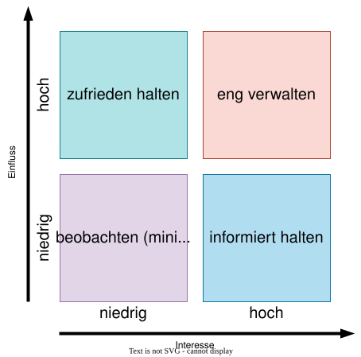
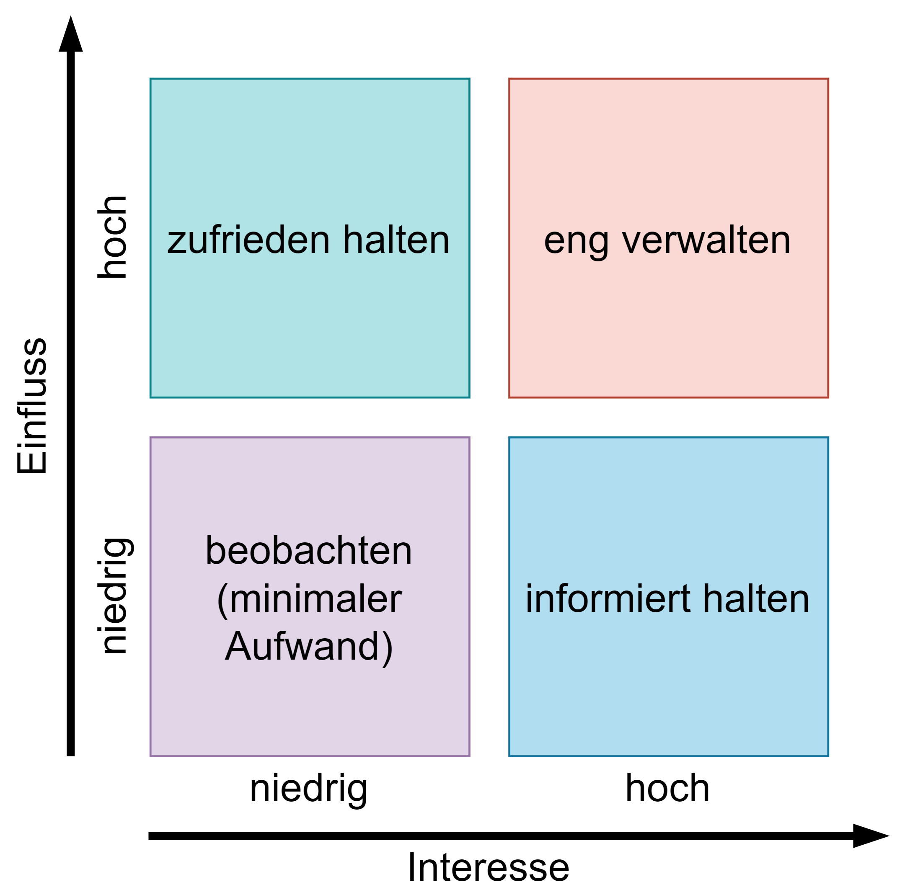
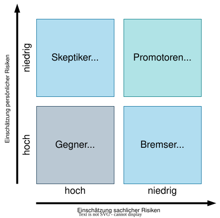
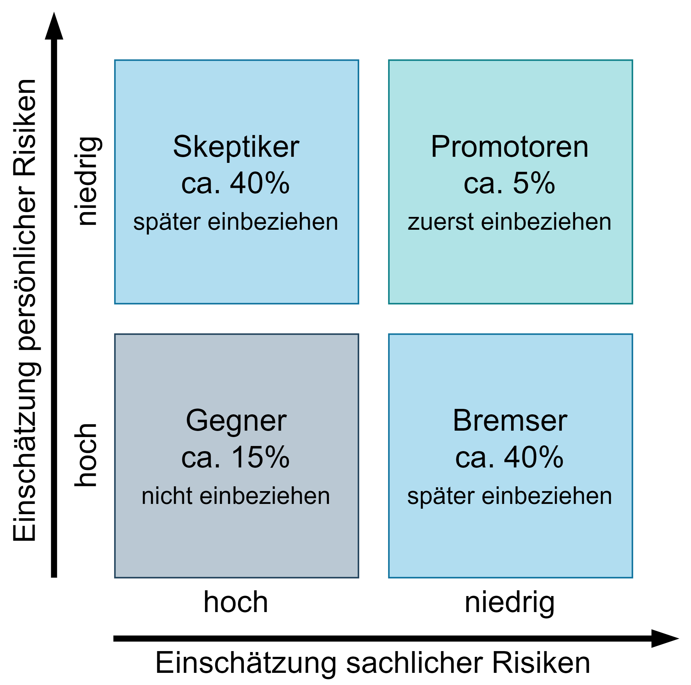

---
format:
  html:
    embed-resources: true
lang: de
bibliography: Literatur.bib
headlines:
  off: true
---

<!--
title: "DEB Produktentwicklung"
format:
  html:
    embed-resources: true

author:
  - name: "Christian Anders"
    degrees: 
    roles: "Dozent"
    email: christian.anders@hs-esslingen.de
    affiliation: 
      - name: "Hochschule Esslingen"
        department: "Wirtschaft & Technik"
        group: "Digital Engineering (DEB)"
        city: "Esslingen am Neckar"
        postal-code: 73728
        country: "Deutschland"
        url: https://www.hs-esslingen.de/
abstract: > 
  Skript zur Vorlesung und Labor *"Produktentwicklung"* für den Studiengang Digital Engineering DEB
keywords:
  - Produktentstehungsprozess
  - Entwicklungsmethodik
  - Softskills
  - Change Management
  - Akzeptanzmatrix

copyright: 
  holder: Christian Anders
  year: 2025
lang: de
bibliography: Literatur.bib
date: last-modified
toc: true
number-sections: true
scrollable: true
toc-location: right
cap-location: bottom
number-offset: 6
link-external-icon: true
link-external-newwindow: true

headlines:
  off: false
extended-content:
  off: false
-->

<!-- -------------------------------------------------------------------------

                       Change Management

-------------------------------------------------------------------------- -->

::: {.content-visible unless-meta="headlines.off"}
# Softskills
## Change Management
:::

<!-- -------------------------------------------------------------------------

                       Change Management

-------------------------------------------------------------------------- -->

### Change-Management {#sec-changemanagement}

::: {.callout-tip}
## Definition: *"Change Management"*
Unter [Change Management](https://de.wikipedia.org/wiki/Ver%C3%A4nderungsmanagement) lassen sich alle Aufgaben, Maßnahmen und Tätigkeiten zusammenfassen, die eine umfassende, bereichsübergreifende und inhaltlich weitreichende Veränderung – zur Umsetzung neuer Strategien, Strukturen, Systeme, Prozesse oder Verhaltensweisen – in einer Organisation bewirken sollen.
:::

<!-- -------------------------------------------------------------------------

                       Definition Stakeholder

-------------------------------------------------------------------------- -->

::: {.callout-tip}
## Definition *"Stakeholder"*
Als [Stakeholder](https://de.wikipedia.org/wiki/Stakeholder) (deutsch Teilhaber, Interessensgruppe, Interessensvertreter oder Anspruchsberechtigter) wird eine Person oder Gruppe (z.B. Auftraggeber, Kunden, Management) bezeichnet, die ein berechtigtes Interesse am Verlauf oder Ergebnis eines Projekts hat.
:::

<!--
Stakeholder sind eine wichtige Quelle bei der Ermittlung von Anforderungen bereits ab der frühen Projektphase *"Ideenfindung und Konzeptentwicklung"*.

+ Oft viel Wissen vorhanden
+ Herausforderung: alle Bedürfnisse und Wünsche zusammentragen, dokumentieren, mit unterschiedlichen Stakeholdern abstimmen
+ Welches Wissen liegt bei welchem Stakeholder? Risiko: *„Wünsch Dir was“*
+ Teils konkrete Lösungsvorstellung/Lösungswünsche vorhanden → Gefahr der Einschränkung des Lösungsraums für das Entwicklungsteam
-->

<!-- -------------------------------------------------------------------------

                       Stakeholder-Matrix (Power-Interest-Grid)

-------------------------------------------------------------------------- -->

### Stakeholder-Matrix (Power-Interest-Grid) {#sec-stakeholdermatrix}

::: {.callout-tip}
## Definition: *"Stakeholder-Matrix (Power-Interest-Grid)"*
Die Stakeholder-Matrix (engl. Power-Interest-Grid), ist ein Analyseinstrument des Projektmanagements, das dazu dient, Stakeholder systematisch zu identifizieren, zu klassifizieren und insbesondere die Kommunikation zum Management gezielt zu gestalten. Die Stakeholder-Matrix ist ein zentrales Werkzeug im Rahmen des Stakeholder-Managements.
:::

Die Stakeholder-Matrix hilft dem Projektteam, Ressourcen und Kommunikationsaufwand effizient zu steuern, Prioritäten im Stakeholder-Management zu setzen, potenzielle Risiken oder Unterstützungsquellen frühzeitig zu erkennen, und zielgerichtet Maßnahmen zu planen:

+ Wo sind Überzeugungsarbeit und Kommunikation nötig?
+ Wen kann man als Multiplikator nutzen?
+ Welche Widerstände sind zu erwarten und wo lohnt sich Aufwand am meisten?

---

>
*"Man kann nie zu viel informieren."*

---

Die Stakeholder-Matrix basiert auf den zwei Dimensionen 1.) Power (Einfluss, Macht) (das Ausmaß, in dem ein Stakeholder Entscheidungen oder den Verlauf des Projekts beeinflussen kann) und 2.) Interest (Interesse, Betroffenheit) (das Maß, in dem ein Stakeholder am Projektergebnis oder -verlauf interessiert oder davon betroffen ist).

Durch die Einordnung der Stakeholder in eine zweidimensionale Matrix entstehen vier typische Quadranten, die jeweils unterschiedliche Kommunikationsstrategien nahelegen:

| Einfluss (Power) | Interesse (Interest) | Empfohlene Strategie                  |
| ---------------- | -------------------- | ------------------------------------- |
| Hoch             | Hoch                 | Eng einbinden (*„Manage Closely“*)    |
| Hoch             | Niedrig              | Zufrieden halten (*„Keep Satisfied“*) |
| Niedrig          | Hoch                 | Informiert halten (*„Keep Informed“*) |
| Niedrig          | Niedrig              | Beobachten (*„Monitor“*)              |

: Quadranten der Stakeholder-Matrix und Empfehlung zur Kommunikationsstrategie {#tbl-stakeholderquadranten .striped .hover .bordered}

::: {.content-visible unless-meta="fileformat-svg.off"}
{width=52% #fig-stakeholdermatrix}
:::
::: {.content-hidden unless-meta="fileformat-svg.off"}
{width=52% #fig-stakeholdermatrix}
:::

Bei großen Projekten mit einer Vielzahl unterschiedlicher Stakeholder kann die Y-Achse (*"Einfluss"*) stärker ausdifferenziert werden (z. B. in Ablehnung – Duldung – Zustimmung – Commitment) um eine feinere Einschätzung der Stakeholder zu ermöglichen.

<!-- -------------------------------------------------------------------------

                       Akzeptanzmatrix

-------------------------------------------------------------------------- -->
### Akzeptanzmatrix {#sec-akzeptanzmatrix}

<!--
::: {.callout-tip}
## Definition: *"Akzeptanzmatrix"*
tbd.
:::
-->

::: {.content-visible unless-meta="fileformat-svg.off"}
{width=52% #fig-akzeptanzmatrix}
:::
::: {.content-hidden unless-meta="fileformat-svg.off"}
{width=52% #fig-akzeptanzmatrix}
:::

<!-- --------------------------------------------------------------------------
EXTENDED CONTENT  -  EXTENDED CONTENT  -  EXTENDED CONTENT  -  EXTENDED CONTENT
S T A R T -->
::: {.content-visible unless-meta="extended-content.off"}
<!-- ---------------------------------------------------------------------- -->

<!-- ---------------------------------------------------------------------- -->
:::
<!-- S T O P
EXTENDED CONTENT  -  EXTENDED CONTENT  -  EXTENDED CONTENT  -  EXTENDED CONTENT
--------------------------------------------------------------------------- -->

