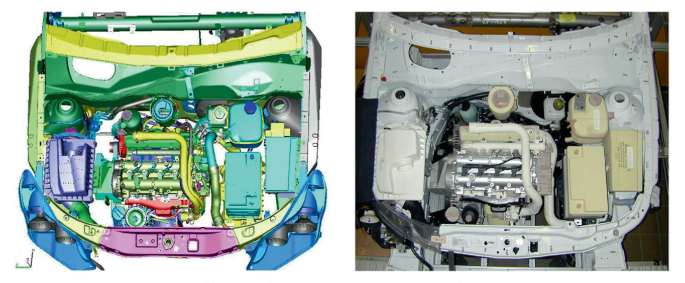

<!-- -------------------------------------------------------------------------

                       Callout !!! WARNING !!!

-------------------------------------------------------------------------- -->
::: {.callout-warning}
## WARNING!
**THIS DOCUMENT IS STILL WORK IN PROGRESS!!!**
:::

<!-- -------------------------------------------------------------------------

                       DMU:: Digital Mock Up

-------------------------------------------------------------------------- -->

### Digital Mock-Up (DMU) {#sec-dmu}

::: {.callout-tip}
## Definition: *"Digital Mock-Up (DMU)"*
Ein [Digital Mock-Up](https://de.wikipedia.org/wiki/Digital_Mock-Up) (DMU) ist eine virtuelle Darstellung eines Produkts oder Systems, das oft mithilfe von CAD-Software (Computer-Aided Design) erstellt wird. Es repräsentiert das Produkt in digitaler Form, im Idealfall einschließlich aller Komponenten, Baugruppen, Verbindungen und Funktionen.
:::

::: {.callout-tip}
## Definition: *"Physical Mock-Up (DMU)"*
Ein [Physical Mock-Up](https://de.wikipedia.org/wiki/Physical_Mock-Up) (PMU) (auch: Physisches Versuchsmodell) bzw. bezeichnet ein reales Versuchsmodell, an dem Funktionsweisen getestet und Probleme sichtbar gemacht werden sollen (vgl. auch Prototyp).
:::

Dieser Begriff [Digital Mock-Up](https://de.wikipedia.org/wiki/Digital_Mock-Up) stammt aus dem Bereich des Produktdesigns und der Produktentwicklung, insbesondere in der Fertigungsindustrie.

{width=100% #fig-pmu-dmu}

Die Verwendung eines Digital Mock-Ups (DMUs) bietet verschiedene Vorteile:

+ **Kosteneffizienz**: Die Erstellung und Iteration von virtuellen Prototypen ist in der Regel kostengünstiger als die Herstellung physischer Prototypen.

+ **Zeitersparnis**: Änderungen und Anpassungen können schnell und einfach am digitalen Modell vorgenommen werden, ohne dass [physische Prototypen](https://de.wikipedia.org/wiki/Physical_Mock-Up) extra aufgebaut oder modifiziert werden müssen.

+ **Kollaboration**: Digitale Mock-Ups ermöglichen eine verbesserte Zusammenarbeit zwischen verschiedenen Teams und Abteilungen, da das Modell leicht zugänglich und über das Internet geteilt werden kann.

+ **Visualisierung**: Ein Digital Mock-Up bietet eine realistische Visualisierung des Produkts und dessen Montagefolge, was es dem Entwicklungsteam ermöglicht, das Design sehr frühzeitig zu überprüfen und potenzielle Probleme frühzeitig zu identifizieren.

+ **Simulationsmöglichkeiten**: Durch die Integration von Simulationssoftware können in einem Digital Mock-Up verschiedene Tests durchgeführt werden, um das Verhalten des Produkts unter verschiedenen Bedingungen zu analysieren (siehe → [Functional Digital Mock-Up (FMU)](https://de.wikipedia.org/wiki/Functional_Digital_Mock-Up))

::: {.callout-tip}
## Pro-Tipp! *"Biegeschlaffe Teile"*
Im Kontext des Digital Mock-Up (DMU) bezeichnet der Begriff *"biegeschlaffe Teile"* Komponenten, die keine oder nur sehr geringe Eigensteifigkeit besitzen und sich daher leicht unter ihrem Eigengewicht oder unter geringen äußeren Kräften verformen, z.B. Kabel oder Schläuche. Im Digital Mock-Up werden biegeschlaffe Teile falls möglich nicht als starre Geometrien modelliert, sondern unter Berücksichtigung ihrer Verformung dargestellt. Ziele dabei sind u.a. 

+ die Plausibilitätsprüfung der Verlegung (z. B. Kabelbaumverlauf, Schlauchführung), 
+ die Erkennung von möglichen Kollisionen, 
+ die Überprüfung von Einbau- und Wartungszugänglichkeit sowie 
+ die virtuelle Absicherung der Funktion und Montage bereits vor der Verfügbarkeit von physischen Prototypen.
:::

