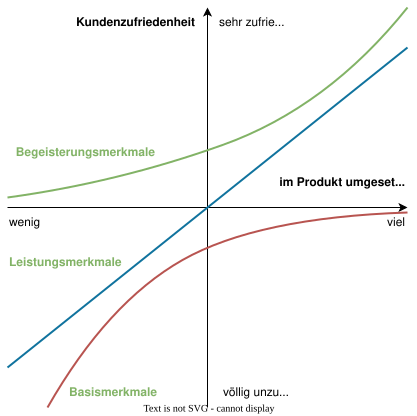
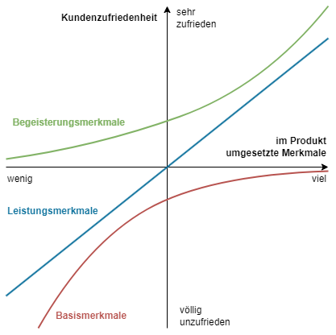

---
format:
  html:
    embed-resources: true
lang: de
bibliography: Literatur.bib
headlines:
  off: true
---

<!--
headlines:
  off: true
extended-content:
  off: false
included-content:
  off: false
worksheets:
  off: true
-->

<!--
title: "DEB Produktentwicklung"
format:
  html:
    embed-resources: true

author:
  - name: "Christian Anders"
    degrees: 
    roles: "Dozent"
    email: christian.anders@hs-esslingen.de
    affiliation: 
      - name: "Hochschule Esslingen"
        department: "Wirtschaft & Technik"
        group: "Digital Engineering (DEB)"
        city: "Esslingen am Neckar"
        postal-code: 73728
        country: "Deutschland"
        url: https://www.hs-esslingen.de/
abstract: > 
  Skript zur Vorlesung und Labor *"Produktentwicklung"* für den Studiengang Digital Engineering DEB
keywords:
  - Produktentstehungsprozess
  - Entwicklungsmethodik
  - Kano-Modell der Kundenzufriedenheit

copyright: 
  holder: Christian Anders
  year: 2025
lang: de
bibliography: Literatur.bib
date: last-modified
toc: true
number-sections: true
scrollable: true
toc-location: right
cap-location: bottom
number-offset: 0
link-external-icon: true
link-external-newwindow: true
-->

<!--
number-offset: 
0 Grundlagen
1 Ideenfindung und Konzeptentwicklung
2 Entwurfs- und Entwicklungsphase
3 Prototyping und Test
4 Produktionsplanung und Produktion
5 Softskills
6 Literatur 
7 Anhang
-->

<!-- -------------------------------------------------------------------------

                       Kano-Modell

-------------------------------------------------------------------------- -->

::: {.content-visible unless-meta="headlines.off"}
# Grundlagen
## Methodische Grundlagen
:::

### Kano-Modell {#sec-kano}

::: {.callout-tip}
## Definition: *"Kano-Modell"*
Das [Kano-Modell](https://de.wikipedia.org/wiki/Kano-Modell) ist ein Modell zum systematischen Erringen der Kundenzufriedenheit für ein Produkt. Das Modell beschreibt den Zusammenhang zwischen dem Erreichen bestimmter Eigenschaften eines Produktes und der erwarteten Kundenzufriedenheit.
::: 

Das Kano-Modell wurde  1978 von [Noriaki Kanō](https://de.wikipedia.org/wiki/Noriaki_Kan%C5%8D), einem japanischen Wissenschaftler und Qualitätsmanagement-Experten, entwickelt. 

Noriaki Kanō stellte die bis dahin als gültig angesehene Annahme in Frage, dass die Verbesserung jedes einzelnen Merkmals des Produkts oder der Dienstleistung eines Unternehmens zu einer höheren Kundenzufriedenheit führen würde. Kanō vertrat stattdessen die Ansicht, dass nicht alle Merkmale der Produkte oder Dienstleistungen in den Augen der Kunden gleich seien und dass einige Merkmale eine höhere Kundenzufriedenheit erzeugen würden als andere. Dies Annahme stellte die Grundlage für das nach ihm benannte Kano-Modell dar.

Das Kano-Modell ist heute etabliert und dient dazu, Kundenanforderungen und deren Einfluss auf die Zufriedenheit mit dem Produkt systematisch zu analysieren und so die Wünsche und Erwartungen von Kunden zu erfassen und bei der Produktentwicklung gezielt zu berücksichtigen.

Das Kano-Modell unterscheidet hierzu fünf Arten von Produkteigenschaften, die sich unterschiedlich auf die Kundenzufriedenheit auswirken:  

1. **Basismerkmale** *(„Must-be“)*: Diese Eigenschaften werden vom Kunden erwartet und als selbstverständlich angesehen. Falls sie fehlen, führt das zu starker Unzufriedenheit, aber ihre Existenz erzeugt keine besondere Freude. Beispiel: Ein Auto muss Bremsen haben – niemand freut sich extra darüber, aber ohne sie wäre es unbrauchbar.  

2. **Leistungsmerkmale** *(„Performance“)*: Diese Merkmale beeinflussen die Zufriedenheit direkt proportional: Je besser sie erfüllt sind, desto zufriedener ist der Kunde. Beispiel: Der Kraftstoff- oder Stromverbrauch eines Autos – je niedriger, desto besser.  

3. **Begeisterungsmerkmale** *(„Excitement“)*: Diese Merkmale erwartet der Kunde nicht, aber sie erzeugen positive Überraschung und hohe Zufriedenheit. *"Begeisterungsmerkmale überzeugen Kunden!"* Falls sie fehlen, ist der Kunde jedoch nicht unzufrieden. Beispiel: Eine Sitzheizung in einem sehr preisgünstigen Auto.

4. **Indifferente Merkmale** *(„Indifferent“)*: Diese Eigenschaften sind dem Kunden egal – sie beeinflussen weder Zufriedenheit noch Unzufriedenheit. Beispiel: Der genaue RAL-Farbton der Verpackung des beim Auto mitgelieferten Warndreiecks.  

5. **Rückweisungsmerkmale** *(„Reverse“)*: Manche Kunden empfinden bestimmte Features sogar als störend. Beispiel: Ein zu kompliziertes Touchscreen-System mit mehreren Untermenues zum Ein-/Ausschalten der Umluftfunktion in einem Auto statt einer einfachen Ein-/Aus-Taste.  

::: {.content-visible unless-meta="fileformat-svg.off"}
{width=64% #fig-kanomodell}
:::
::: {.content-hidden unless-meta="fileformat-svg.off"}
{width=64% #fig-kanomodell}
:::

Das Kano-Modell wird in der Produktentwicklung verwendet mit dem Ziel, Eigenschaften eines Produkts bei der Produktentwicklung gezielt zu priorisieren:

1. **Basismerkmale** sicherstellen und zugleich die Basismerkmale, die keinen greifbaren Wert bringen, reduzieren.

2. **Leistungsmerkmale** optimieren.

3. **Begeisterungsmerkmale** strategisch einsetzen.

4. **Rückweisungsmerkmale** vermeiden.

::: {.callout-warning}
## Kundenbewertung von Produkteigenschaften ändert sich mit der Zeit!
Über mehrere Produktgenerationen hinweg verändern sich die Kundenbewertung von Eigenschaften. Ein Begeisterungs-Merkmal kann zu einem Leistungs- und später zu einem Basis-Merkmal werden.
:::

<!-- -------------------------------------------------------------------------

                       WIKIPEDIA

-------------------------------------------------------------------------- -->
<!--

Das Kano-Modell unterscheidet fünf Ebenen der Qualität (Quelle: wikipedia):

+ Basis-Merkmale (Muss-Merkmale), die so grundlegend und selbstverständlich sind, dass sie den Kunden erst bei Nichterfüllung bewusst werden (implizite Erwartungen). Werden die Grundforderungen nicht erfüllt, entsteht Unzufriedenheit; werden sie erfüllt, entsteht aber keine Zufriedenheit. Die Nutzensteigerung im Vergleich zur Differenzierung gegenüber Wettbewerbern ist sehr gering.
+ Leistungs-Merkmale (Soll-Merkmale) sind dem Kunden bewusst, sie beseitigen Unzufriedenheit oder schaffen Zufriedenheit abhängig vom Ausmaß der Erfüllung.
+ Begeisterungs-Merkmale (Kann-Merkmale) sind dagegen Nutzen stiftende Merkmale, mit denen der Kunde nicht unbedingt rechnet. Sie zeichnen das Produkt gegenüber der Konkurrenz aus und rufen Begeisterung hervor. Eine kleine Leistungssteigerung kann zu einem überproportionalen Nutzen führen. Die Differenzierungen gegenüber der Konkurrenz können gering sein, der Nutzen aber enorm.
+ Unerhebliche Merkmale sind sowohl bei Vorhandensein als auch bei Fehlen ohne Belang für den Kunden. Sie können daher keine Zufriedenheit stiften, führen aber auch zu keiner Unzufriedenheit.
+ Rückweisungs-Merkmale: Führen bei Vorhandensein zu Unzufriedenheit, bei Fehlen jedoch nicht zu mehr Zufriedenheit des Kunden.
-->