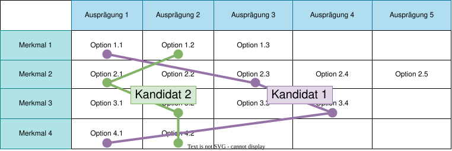
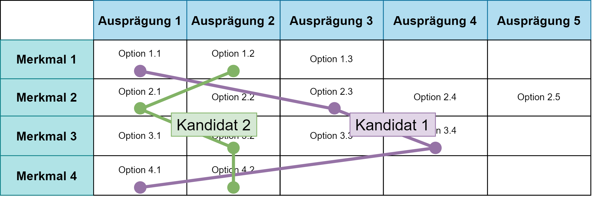

<!--
format:
  html:
    embed-resources: true
lang: de
bibliography: Literatur.bib

headlines:
  off: true
extended-content:
  off: false
included-content:
  off: false
worksheets:
  off: true
-->

<!--
title: "DEB Produktentwicklung"
format:
  html:
    embed-resources: true

author:
  - name: "Christian Anders"
    degrees: 
    roles: "Dozent"
    email: christian.anders@hs-esslingen.de
    affiliation: 
      - name: "Hochschule Esslingen"
        department: "Wirtschaft & Technik"
        group: "Digital Engineering (DEB)"
        city: "Esslingen am Neckar"
        postal-code: 73728
        country: "Deutschland"
        url: https://www.hs-esslingen.de/
abstract: > 
  Skript zur Vorlesung und Labor *"Produktentwicklung"* für den Studiengang Digital Engineering DEB
keywords:
  - Morphologischer Kasten
  - Kompatibilitätsmatrix

copyright: 
  holder: Christian Anders
  year: 2026
lang: de
bibliography: Literatur.bib
date: last-modified
toc: true
number-sections: true
scrollable: true
toc-location: right
cap-location: bottom
number-offset: 0
link-external-icon: true
link-external-newwindow: true
-->

<!--
number-offset: 
0 Grundlagen
1 Ideenfindung und Konzeptentwicklung
2 Entwurfs- und Entwicklungsphase
3 Prototyping und Test
4 Produktionsplanung und Produktion
5 Softskills
6 Literatur 
7 Anhang
-->

<!--
::: {.content-visible unless-meta="headlines.off"}
# Grundlagen
## Begriffe
:::
-->

<!-- -------------------------------------------------------------------------

                       Callout !!! WARNING !!!

-------------------------------------------------------------------------- -->
<!--
::: {.callout-warning}
## WARNING!
**THIS CHAPTER IS STILL WORK IN PROGRESS!!!**
:::
-->

<!-- -------------------------------------------------------------------------

                       Morphologischer Kasten

-------------------------------------------------------------------------- -->

### Morphologischer Kasten (Fritz Zwicky) {#sec-morphologischerkasten}

::: {.callout-tip}
## Begriffsklärung *"Morphologischer Kasten"*
Der [morphologische Kasten](https://de.wikipedia.org/wiki/Morphologische_Analyse_(Kreativit%C3%A4tstechnik)) ist ein strukturiertes Analysewerkzeug und zugleich eine Kreativitätstechnik, das ein komplexes Problem in seine wesentlichen Parameter (Merkmale) zerlegt und für jeden Parameter die möglichen Ausprägungen auflistet. Diese Kombinationen aller möglichen Parameter-Ausprägungen bilden einen mehrdimensionalen Lösungsraum, in dem neue, oft ungewohnte Lösungsansätze identifiziert werden können.
:::

Ziel des morphologischen Kastens ist es, mögliche Lösungen für jeden Teilaspekt zu kombinieren um eine oder mehrere gesamtheitliche Lösungen für das zu entwickelnde Produkt zu finden.

Der morphologische Kasten (auch als *"morphologisches Tableau"* oder *"morphologische Analyse"* bezeichnet) ist eine Methode der systematischen Problemanalyse und Lösungsfindung, die vom Schweizer Astrophysiker [Fritz Zwicky](https://de.wikipedia.org/wiki/Fritz_Zwicky) um das Jahr 1960 entwickelt wurde. 

Der morphologische Kasten besteht in der Regel aus einer Tabelle, die die einzelnen **Merkmale** oder Komponenten in separaten Zeilen auflistet, während die möglichen **Ausprägungen** für jedes Merkmal in den entsprechenden Spalten aufgeführt werden (siehe → @fig-morphologischerkasten). 

::: {.content-visible unless-meta="fileformat-svg.off"}
{width=84% #fig-morphologischerkasten}
:::
::: {.content-hidden unless-meta="fileformat-svg.off"}
{width=84% #fig-morphologischerkasten}
:::

Für jedes einzelne **Merkmal** kann für jeweils eine **Konstruktionsvariante** (siehe → Variantenkonstruktion @sec-variantenkonstruktion) jeweils nur eine **Ausprägung** gewählt werden. 

Verschiedene Konstruktionsvarianten werden oftmals auch als ***"Kandidaten"*** bezeichnet und in Form eines **linienförmigen Overlays** über dem morphologischen Kasten dargestellt. Unterschiedliche Kandidaten können zu einzelnen Merkmalen die gleichen Ausprägungen verwenden, müssen sich jedoch zu mindestens einem Merkmal in der Ausprägung unterscheiden.

::: {.callout-tip}
## Pro-Tipps!
+ Existieren für ein Merkmal weniger Ausprägungen als Spalten in dem morphologischen Kasten enthalten sind bleiben die Zellen leer. 
+ Für jedes in einem morphologischen Kasten aufgeführten Merkmal muss mindestens eine Ausprägung verfügbar sein, andernfalls kann die das Merkmal erfordernde Konstruktionsvariante des Produkts nicht dargestellt werden. 
+ Als Option einer Ausprägung kann ggf. auch auf *"leer"* im Sinne von *"nicht relevant, nicht erforderlich, nicht verwendet"* zurückgegriffen werden.
:::

#### Beispiel: Morphologischen Kastens für die Gestaltung eines Kraftfahrzeugs

Ein Anwendungsbeispiel für einen morphologischen Kasten zeigt @tbl-mkkfz.

| **Merkmal**       | Ausprägung 1        | Ausprägung 2        | Ausprägung 3        | Ausprägung 4        | Ausprägung 5        |
|-------------------|---------------------|---------------------|---------------------|---------------------|---------------------|
| **Motor**         | EMotor              | ICE^[Internal Combustion Engine]                 | Hybrid              |                     |                     |
| **Energieträger** | Benzin              | Diesel              | Strom               | LNG^[Liquified Natural Gas]                 | H2                  |
| **Getriebe**      | Automatik           | Manuell             | 1-Gang              |                     |                     |
| **Antrieb**       | Front               | Heck                | Allrad              |                     |                     |

: Morphologischer Kasten für die Gestaltung eines Kraftfahrzeugs. {#tbl-mkkfz .striped .hover .bordered tbl-colwidths="[25,15,15,15,15,15]"}

::: {.callout-tip}
## Pro-Tipp!
In der betrieblichen Praxis werden oftmals die für die nachfolgende konkrete Produktentwicklung vorgesehenen ***"Kandidaten"*** als Overlay über den morphologischen Kasten gelegt, z.B. *"EMotor - Strom - 1-Gang - Front"* als Ecktyp für einen PKW, *"ICE - Diesel - Manuell - Allrad"* als Ecktyp für ein Offroad-Geländefahrzeug, jeweils basierend auf der selben Fahrzeugplattform.
:::

<!-- --------------------------------------------------------------------------
EXTENDED CONTENT  -  EXTENDED CONTENT  -  EXTENDED CONTENT  -  EXTENDED CONTENT
S T A R T 
::: {.content-visible unless-meta="extended-content.off"}
<!-- ---------------------------------------------------------------------- -->
<!-- -------------------------------------------------------------------------

                       Aufgabe: Erweiterung morphologischer Kasten 

-------------------------------------------------------------------------- -->

<!--
::: {.callout-note collapse="false"}
## Aufgabe: Ergänzung Brennstoffzelle im morphologischen Kasten (Dauer 5 min)
Wie würde der morphologischen Kasten erweitert werden müssen wenn die Möglichkeit, das Fahrzeug mit einer Brennstoffzelle (BZ) auszustatten, mit aufgenommen werden sollte?
:::

::: {.callout-tip collapse="true"}
## Lösungsvorschlag: Ergänzung Brennstoffzelle im morphologischen Kasten
| **Merkmal**       | Ausprägung 1        | Ausprägung 2        | Ausprägung 3        | Ausprägung 4        | Ausprägung 5        |
|-------------------|---------------------|---------------------|---------------------|---------------------|---------------------|
| **Motor**         | EMotor              | ICE                 | Hybrid              |                     |                     |
| **Energieträger** | Benzin              | Diesel              | Strom               | LNG                 | H2                  |
| **Energiewandler**| BZ                  |                     |                     |                     |                     |
| **Getriebe**      | Automatik           | Manuell             | 1-Gang              |                     |                     |
| **Antrieb**       | Front               | Heck                | Allrad              |                     |                     |

: Morphologischer Kasten für die Gestaltung eines Kraftfahrzeugs, erweitert um die Brennstoffzelle als Energiewandler von Wasserstoff → Strom. {#tbl-mkkfzbz .striped .hover .bordered tbl-colwidths="[25,15,15,15,15,15]"}
:::

-->
<!-- ---------------------------------------------------------------------- ---
:::
<!-- S T O P
EXTENDED CONTENT  -  EXTENDED CONTENT  -  EXTENDED CONTENT  -  EXTENDED CONTENT
--------------------------------------------------------------------------- -->

<!-- -------------------------------------------------------------------------

                       Kompatibilitätsmatrix

-------------------------------------------------------------------------- -->
#### Beispiel: Kompatibilitätsmatrix für die Gestaltung eines Kraftfahrzeugs

In der Praxis können bestimmte Kombinationen aufgrund von technischen Einschränkungen oder weiteren Kriterien nicht möglich oder nicht sinnvoll sein. 

Der morphologische Kasten wird daher häufig um eine **Kompatibilitätsmatrix** ergänzt, in der alle realisierbaren sowie die nicht zu realisierenden oder unmöglichen Kombinationen der verschiedenen Merkmale und Ausprägungen dargestellt werden. 

Die Kompatibilitätsmatrix gibt an, welche Kombinationen der einzelnen Optionen miteinander kompatibel sind, basierend auf praktischen oder technischen Einschränkungen oder weiteren Kriterien. Ein Beispiel für eine Kompatibilitätsmatrix zeigt @tbl-kmkfz.

|                 | EMotor    | ICE       | Hybrid    | Benzin    | Diesel    | Strom     | LNG       | …         |
|-----------------|-----------|-----------|-----------|-----------|-----------|-----------|-----------|-----------|
| **EMotor**          | -         | Nein      | Nein      | Nein      | Nein      | Ja        | Nein      | …         |
| **ICE**             | Nein      | -         | Nein      | Ja        | Ja        | Nein      | Ja        | …         |
| **Hybrid**          | Nein      | Nein      | -         | Ja        | Ja        | Ja        | Ja        | …         |
| **Benzin**          | Nein      | Ja        | Ja        | -         | Nein      | Nein      | Nein      | …         |
| **Diesel**          | Nein      | Ja        | Ja        | Nein      | -         | Nein      | Nein      | …         |
| **Strom**           | Ja        | Nein      | Ja        | Nein      | Nein      | -         | Nein      | …         |
| **LNG**             | Nein      | Ja        | Ja        | Nein      | Nein      | Nein      | -         | …         |
| **H2**              | Nein      | Nein      | Nein      | Nein      | Nein      | Nein      | Nein      | …         |
| **Automatik**       | Nein      | Ja        | Ja        | Ja        | Ja        | Ja        | Ja        | …         |
| **Manuell**         | Nein      | Ja        | Nein      | Ja        | Ja        | Nein      | Ja        | …         |
| **1-Gang**          | Ja        | Nein      | Nein      | Nein      | Nein      | Ja        | Nein      | …         |
| **Front**           | Ja        | Ja        | Ja        | Ja        | Ja        | Ja        | Ja        | …         |
| **Heck**            | Ja        | Ja        | Ja        | Ja        | Ja        | Ja        | Ja        | …         |
| **Allrad**          | Ja        | Ja        | Ja        | Ja        | Ja        | Ja        | Ja        | …         |

: Ausschnitt aus der Kompatibilitätsmatrix zum in @tbl-mkkfz gezeigten morphologischen Kasten zur Gestaltung eines Kraftfahrzeugs.  {#tbl-kmkfz .striped .hover .bordered}

<!-- -------------------------------------------------------------------------

                       Morphologischer Kasten in der Produktionstechnik

-------------------------------------------------------------------------- -->
#### Morphologischer Kasten in der Produktionstechnik

Der morphologische Kasten kann auch in der Produktionstechnik verwendet werden. Hierzu werden die zur Herstellung des Produkts notwendigen Produktionsschritte als Merkmale, die zur Darstellung des jeweiligen Produktionsschritts verfügbaren Verfahren als Ausprägungen in dem morphologischen Kasten und der Kompatibilitätsmatrix dargestellt. 

Dieses Vorgehen ist besonders wirkungsvoll, wenn zum Ranking der jeweiligen Verfahren auf Bewertungsmatrizen (siehe → Bewertungsmatrix @sec-bewertungsmatrix) zurückgegriffen wird.

| **Produktionsschritt** | Ausprägung 1        | Ausprägung 2        | Ausprägung 3        |
|------------------------|---------------------|---------------------|---------------------|
| **1. Fügen**           | Einpressen          | Kleben              |                     |
| **2. Abisolieren**     | Schneiden           | Laser               | Schneiden-Klemmen   |
| **3. Kontaktieren**    | Löten               | Verstemmen          | Schneiden-Klemmen   |
| **4. Wuchten**         | Positives Wuchten   | Negatives Wuchten   | Cold-Metal-Transfer |

: Morphologischer Kasten für die Gestaltung von Prozessen in der Produktionstechnik am Beispiel von drei Produktionsschritten des Rotors für eine Asynchronmaschine. {#tbl-mkpwt .striped .hover .bordered tbl-colwidths="[25,25,25,25]"}

::: {.callout-tip}
## Pro-Tipp!
In der betrieblichen Praxis werden die für die nachfolgende konkrete Produktionstechnik vorgesehenen Kandidaten oftmals als Overlay über den morphologischen Kasten gelegt, z.B. *"Kleben - Schneid-Klemm-Kontaktieren - Cold-Metal-Transfer-Wuchten"* (*"Innovativ"*) vs. *"Einpressen - Schneiden mit rotierenden Messern - Löten - Negatives Wuchten*" ("*Konservativ"*) und nachfolgend zumeist in gemeinsamen Workshops von Fachexperten betroffener Bereiche insbesondere hinsichtlich der Prozesse und den mit der jeweiligen Prozessfolge verbundenen Kosten, Chancen und Risiken bewertet und gegeneinander gerankt. 

So hat im in Tabelle @tbl-mkpwt gezeigten Beispiel die Prozessfolge (aka *"Kandidat"*) *"Innovativ"* z.B. einen Prozessschritt weniger als die traditionell genutzte klassische Prozessfolge (aka *"Kandidat"*) "*Konservativ"*. Diesem Vorteil steht aber u.a. das Risiko der Verwendung eines bis dato möglicherweise noch nicht in der Großserienfertigung genutzten Schneid-Klemm-Verfahrens gegenüber (siehe siehe → Bewertungsmatrix @sec-bewertungsmatrix, siehe → Risikomanagement @sec-risikomanagement).
:::
