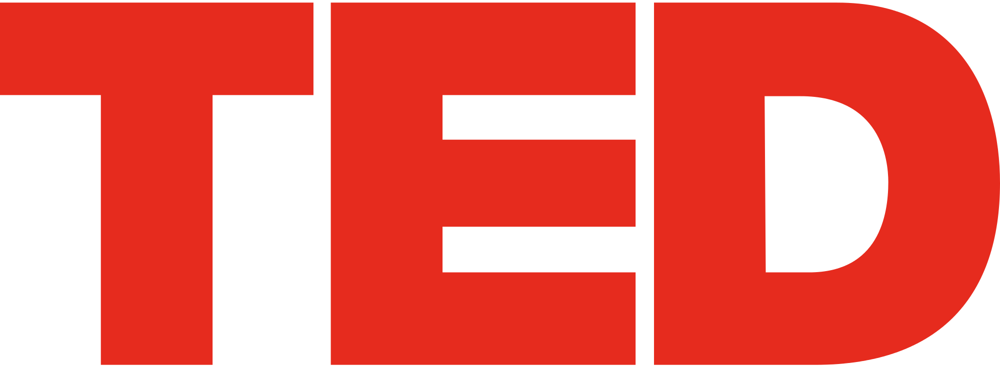

---
format:
  html:
    embed-resources: true
lang: de
bibliography: Literatur.bib
headlines:
  off: true
extended-content:
  off: true
fileformat-svg:
  off: true
---

<!--
headlines:
  off: true
extended-content:
  off: false
included-content:
  off: false
worksheets:
  off: true
-->

<!--
title: "DEB Produktentwicklung"
format:
  html:
    embed-resources: true

author:
  - name: "Christian Anders"
    degrees: 
    roles: "Dozent"
    email: christian.anders@hs-esslingen.de
    affiliation: 
      - name: "Hochschule Esslingen"
        department: "Wirtschaft & Technik"
        group: "Digital Engineering (DEB)"
        city: "Esslingen am Neckar"
        postal-code: 73728
        country: "Deutschland"
        url: https://www.hs-esslingen.de/
abstract: > 
  Skript zur Vorlesung und Labor *"Produktentwicklung"* für den Studiengang Digital Engineering DEB
keywords:
  - Produktentstehungsprozess
  - Wirtschaftlichkeit
  - Lebenszykluskosten

copyright: 
  holder: Christian Anders
  year: 2025
lang: de
bibliography: Literatur.bib
date: last-modified
toc: true
number-sections: true
scrollable: true
toc-location: right
cap-location: bottom
number-offset: 0
link-external-icon: true
link-external-newwindow: true
-->

<!--
number-offset: 
0 Grundlagen
1 Ideenfindung und Konzeptentwicklung
2 Entwurfs- und Entwicklungsphase
3 Prototyping und Test
4 Produktionsplanung und Produktion
5 Softskills
6 Literatur 
7 Anhang
-->

<!-- -------------------------------------------------------------------------

                       Callout !!! WARNING !!!

-------------------------------------------------------------------------- -->
<!--
::: {.callout-warning}
## WARNING!
**THIS CHAPTER IS STILL WORK IN PROGRESS!!!**
:::
-->

<!-- -------------------------------------------------------------------------

                       Motivation und Inspiration

-------------------------------------------------------------------------- -->
### Motivation und Inspiration

---

>*"You never fail until you stop trying."*

---

::: {.callout-important}
## Wichtiger Hinweis!
Die im Folgenden aufgeführten/verlinkten Beiträge geben persönliche Meinung und Sichtweisen wieder, die Auswahl der Beiträge basiert ausschließlich auf subjektiven Kriterien Ihres Dozenten. Die Beiträge sollen  lediglich Denkanstösse anbieten. Der geneigte Leser ist dringendst aufgefordert die aufgeführten Beiträge kritisch zu hinterfragen und eigene Perspektiven zu entwickeln!
:::

#### TED-Talks (via YouTube)

{width=20%}

+ [TED](https://www.youtube.com/@TED)
+ [TEDx](https://www.youtube.com/@TEDx)
+ [TED-Archives](https://www.youtube.com/@TEDTalks)

#### YouTube

{width=20%}

+ [Simon Sinek](https://www.youtube.com/@SimonSinek)

#### Instagram

<!-- -------------------------------------------------------------------------

                       Bild Instagram-Logo 2022

-------------------------------------------------------------------------- -->

{width=20%}

+ [Simon Sinek](https://www.instagram.com/simonsinek/)

#### Leadership

{width=20%}

+ [Martin Gutmann: *"Why do we celebrate incompetent leaders?"*](https://www.youtube.com/watch?v=DU06c7f9fzc)

+ [Hamdi Ulukaya: *"The anti-CEO playbook"*](https://www.youtube.com/watch?v=SGTMSV8QUrs)

<!--
### Miscellaneous

{width=20%}

+ [Simon Sinek](https://youtu.be/4oN5JShOs2I)
+ [Simon Sinek](https://www.youtube.com/watch?v=NcaQUH2K-wo)
+ [Simon Sinek](https://www.youtube.com/watch?v=xNgQOHwsIbg)
-->