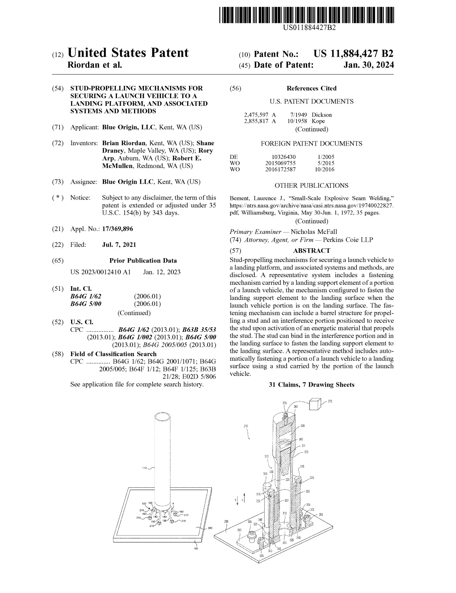

<!--
format:
  html:
    embed-resources: true
lang: de
bibliography: Literatur.bib

headlines:
  off: true
extended-content:
  off: false
included-content:
  off: false
worksheets:
  off: true
-->

<!--
title: "DEB Produktentwicklung"
format:
  html:
    embed-resources: true

author:
  - name: "Christian Anders"
    degrees: 
    roles: "Dozent"
    email: christian.anders@hs-esslingen.de
    affiliation: 
      - name: "Hochschule Esslingen"
        department: "Wirtschaft & Technik"
        group: "Digital Engineering (DEB)"
        city: "Esslingen am Neckar"
        postal-code: 73728
        country: "Deutschland"
        url: https://www.hs-esslingen.de/
abstract: > 
  Skript zur Vorlesung und Labor *"Produktentwicklung"* für den Studiengang Digital Engineering DEB
keywords:
  - Stochastik

copyright: 
  holder: Christian Anders
  year: 2025
lang: de
bibliography: Literatur.bib
date: last-modified
toc: true
number-sections: true
scrollable: true
toc-location: right
cap-location: bottom
number-offset: 0
link-external-icon: true
link-external-newwindow: true
-->

<!--
number-offset: 
0 Grundlagen
1 Ideenfindung und Konzeptentwicklung
2 Entwurfs- und Entwicklungsphase
3 Prototyping und Test
4 Produktionsplanung und Produktion
5 Softskills
6 Literatur 
7 Anhang
-->

<!-- -------------------------------------------------------------------------

                       Patente

-------------------------------------------------------------------------- -->
<!--
::: {.content-visible unless-meta="headlines.off"}
# Grundlagen
## Begriffe
:::
-->

<!-- -------------------------------------------------------------------------

                       Callout !!! WARNING !!!

-------------------------------------------------------------------------- -->

<!--
::: {.callout-warning}
## WARNING!
**THIS CHAPTER IS STILL WORK IN PROGRESS!!!**
:::
-->

### Patente {#sec-patente}

::: {.callout-tip}
## Begriffsklärung *"Patent"*
Ein [Patent](https://de.wikipedia.org/wiki/Patent) ist ein hoheitlich erteiltes gewerbliches [Schutzrecht](https://de.wikipedia.org/wiki/Geistiges_Eigentum) für eine Erfindung. 
:::

Unternehmen, die ihre Entwicklungen gegen Nachahmung schützen möchten, versuchen einen **Patentschutz für solche Produkte und Verfahren** zu erreichen, welche zu einem wirtschaftlichen, technischen oder einem Marketingvorteil führen, um sich so einen Wettbewerbsvorteil zu verschaffen. Bezeichnungen wie *"patentiert"* (engl. *"patent pending"*) assoziieren beim potenziellen Käufer einen höheren Wert des Produkts und sollen helfen, höhere Produktpreise zu erzielen.

Ein umfassender Patentbestand eines Unternehmens kann zudem dann hilfreich sein, wenn das Unternehmen von einem Patent eines Wettbewerbers Gebrauch machen möchte (*"Kreuzlizenzierung"*), da es im Gegenzug dem Wettbewerber die Benutzung eines oder mehrerer seiner eigenen Patente in einem Tauschhandel anbieten kann (*"Lässt Du mich Dein Patent nutzen, so lasse ich Dich mein Patent nutzen."*). 

Als **Sperrpatente** werden solche Patente bezeichnet, die vom Patentinhaber nicht genutzt werden, sondern lediglich Dritten den Eintritt in ein bestimmtes Marktsegment verwehren sollen.

Wenn einerseits der Aufwand zur Erlangung eines Patentschutzes vermieden werden soll, gleichzeitig aber verhindert werden soll, dass ein Wettbewerber, der beispielsweise unabhängig dieselbe Entwicklung macht, ein Patent auf diese Technologie erhält, kann eine **[Sperrveröffentlichung](https://de.wikipedia.org/wiki/Defensivpublikation)** getätigt werden.


**Patente gelten territorial**. Patente können weltweit beantragt (und durch die jeweiligen nationalen Patentämter erteilt) werden. Patente können jedoch ebenso auf einzelne oder mehrere Länder begrenzt werden. Auch eine **zeitliche Begrenzung der Patentlaufzeit** ist möglich, z.B. durch Verzicht auf die Verlängerung des Patentschutzes. 


Für die **Zulassung eines Patents** müssen Erfindungen nach dem europäischen und deutschen Patentrecht mehrere zentrale materielle **Voraussetzungen** erfüllen und zusätzlich **patentrechtlich zulässig** sein.


```{mermaid}
%%| label: fig-label-mmzulassungpatent
%%| fig-cap: "Kriterien für die Zulassung von Patenten"
%%{init: {'theme': 'forest'}}%%
mindmap
  root((Patentzulassung))
    (Neuigkeitsgrad)
    (Erfinderische Tätigkeit)
    (Gewerbliche Anwendbarkeit)
    (Technizität)
```


| Kriterium                     | Beschreibung                                                           |
| ----------------------------- | ---------------------------------------------------------------------- |
| **Neuigkeitsgrad**            | Die Erfindung darf **nicht zum Stand der Technik gehören** (Stand der Technik: Alles, was **der Öffentlichkeit vor dem Anmeldetag zugänglich war**, unabhängig von Ort, Sprache oder Medium). |
| **Erfinderische Tätigkeit**   | Die Erfindung muss sich **für den Fachmann nicht in naheliegender Weise** aus dem Stand der Technik ergeben. |
| **Gewerbliche Anwendbarkeit** | Die Erfindung muss **industriell oder gewerblich herstellbar oder nutzbar** sein. |
| **Technizität**               | Die Erfindung muss einen **technischen Charakter** aufweisen. Abstrakte Ideen (**Software *als solche***, Algorithmen, mathematisch Methoden) sind **NICHT** patentfähig. |

: Voraussetzungen für die Zulassung von Patenten {#tbl-voraussetzungenpatent .hover .striped .bordered}

::: {.callout-warning}
## Achtung!
**Abstrakte Ideen** (insb. **Software *als solche***, Algorithmen, mathematisch Methoden) oder allg. **naturwissenschaftliche Entdeckungen** sind **NICHT patentfähig!**
:::

::: {.callout-tip}
## Pro-Tipp!
**Der Eigentümer eines Patents ist berechtigt, anderen die Nutzung der Erfindung zu untersagen, sofern das Patent in dem jeweiligen Land erteilt ist und gültig ist.** Das Schutzrecht wird immer nur auf Zeit gewährt und kann nicht unbegrenzt verlängert werden; in Deutschland gemäß § 16 Patentgesetz für maximal 20 Jahre.
:::


<!-- --------------------------------------------------------------------------
EXTENDED CONTENT  -  EXTENDED CONTENT  -  EXTENDED CONTENT  -  EXTENDED CONTENT
S T A R T 
<!-- ---------------------------------------------------------------------- -->


<!-- -------------------------------------------------------------------------

                       Abbildung Patent US 11,884,427 B2

-------------------------------------------------------------------------- -->
<!--
{width=80% fig-align="center" #fig-patentblueorigin}
-->
<!-- -------------------------------------------------------------------------

                       Abbildung Anwendung des Patents US 11,884,427 B2

-------------------------------------------------------------------------- -->
<!--
{width=80% fig-align="center" #fig-patentblueorigin}
-->
<!-- ---------------------------------------------------------------------- ---
:::
<!-- S T O P
EXTENDED CONTENT  -  EXTENDED CONTENT  -  EXTENDED CONTENT  -  EXTENDED CONTENT
--------------------------------------------------------------------------- -->


Eine Patentanmeldung (und damit die darin beschriebene Erfindung) wird durch das jeweilige nationale Patentamt publiziert (*"[Offenlegung](https://de.wikipedia.org/wiki/Patenterteilungsverfahren#%C3%96ffentlichkeit,_Ver%C3%B6ffentlichung)"*^[Patentanmeldungen und auch später darauf erteilte Patente werden amtlicherseits veröffentlicht. Heute geschieht dies durch Einstellen und Zugänglichmachen der jeweiligen Schriften in öffentlich zugängliche Datenbanken. In allen wichtigen Patentsystemen der Welt werden Patentanmeldungen 18 Monate nach ihrer ersten Anmeldung veröffentlicht. Patente werden unmittelbar nach ihrer Erteilung veröffentlicht. Nicht nur die Ergebnisse sind öffentlich, sondern auch das gesamte Verfahren, so dass Argumentationen und Sichtweisen nachvollzogen werden können. Um dies zu erreichen, gibt es entweder das Mittel der Akteneinsicht, oder die Verfahren können anhand öffentlich zugänglicher Datenbanken nachvollzogen werden. (Quelle: [Wikipedia](https://de.wikipedia.org/wiki/Patenterteilungsverfahren#%C3%96ffentlichkeit,_Ver%C3%B6ffentlichung))]). In der Regel ist **Patentschutz nur bei einer Veröffentlichung der Erfindung** möglich.

<!-- -------------------------------------------------------------------------

                       Kosten für Patente

-------------------------------------------------------------------------- -->
Durch eine Patentanmeldung entstehen (je nach beantragtem Gültigkeitsbereich und angestrebter Laufzeit u.U. erhebliche) Kosten: 

**1. Während des [Anmeldung](https://de.wikipedia.org/wiki/Patentanmeldung) des Patents**: Honorare für Patentanwälte und sonstige Dienstleister (z.B. Patentrechercheure oder Übersetzer) sowie Amtsgebühren für das jeweils zuständige nationale Patentamt.

**2. Während der Laufzeit des Patents**: Jahresgebühren (in Deutschlang gemäß § 17 Patentgesetz) zur Verlängerung des Patentschutzes. 

**Patente sind buchhalterisch erfassbar und können einen Marktwert besitzen.**

In Unternehmen erfolgt die Entscheidung, in welchen Ländern Patente angemeldet und in welchen Ländern erteilte Patente um jeweils ein weiteres Jahr verlängert werden sollen oftmals in sog. ***"Patentreviews"***. Diese Patentreviews finden regelmäßig statt (z.B. einmal je Quartal, mindestens jedoch einmal jährlich), besitzen in der Regel Workshopcharakter und sind bereichsübergreifend (*"crossfunktional"*) besetzt mit Fachexperten aus den Bereichen (technische) Entwicklung, (Patent-)Recht (*"Legal"*) und Kostenrechnung (*"Controlling"*).


::: {.callout-tip}
## Pro-Tipp: *"Sperrveröffentlichung*"
Ein erheblicher Anteil der von Unternehmen eingereichten Patente dient lediglich dazu, die *[Offenlegung](https://de.wikipedia.org/wiki/Patenterteilungsverfahren#%C3%96ffentlichkeit,_Ver%C3%B6ffentlichung)* der Patentschrift zu erreichen, ohne dass angestrebt wird, das Patent tatsächlich zugeteilt zu bekommen. **Ab dem Zeitpunkt der Offenlegung gilt das im Patentantrag dargelegte Produkt oder Verfahren als *"Stand der Technik"* und kann mithin nicht mehr patentiert werden.** Auf diese Weise wird dauerhaft das angestrebte Ziel *"Freedom-to-Operate (FTO)"* erreicht, ohne dass eine mit den hohen Kosten verbundene Erteilung eines Patents erforderlich ist"
:::


```{mermaid}
%%| label: fig-label-mmpatente
%%| fig-cap: "Mindmap wichtiger Aspekte zu Patenten"
%%{init: {'theme': 'forest'}}%%
mindmap
  root((Patente))
    (Schutzrechte)
      (Arten)
        (Patent)
        (Gebrauchsmuster)
        (Design)
        (Marke)
      (Umfang)
        (Räumlicher Geltungsbereich)
        (Zeitliche Begrenzung)
    (Strategische Bedeutung)
      (Innovationsschutz)
      (Wettbewerbsvorteil)
      (Markteintrittsbarrieren)
      (Lizenzierung & Monetarisierung)
      (Schutz vor Nachahmung)
    (Patentierung)
      (Voraussetzungen)
        (Neuheit)
        (Erfinderische Tätigkeit)
        (Gewerbliche Anwendbarkeit)
        (Technizität)
      (Patentansprüche)
      (Offenlegung Beschreibung)
      (Internationale Verfahren)
    (Risiken & Herausforderungen)
      (Kosten)
      (Verletzungsrisiken)
      (Komplexität internationaler Verfahren)
      (Trade-offs Offenlegung vs. Geheimhaltung)
    (Management & Prozesse)
      (Patentportfolio-Management)
      (Monitoring von Wettbewerbern)
    (Produktentwicklung)
      (Freedom-to-Operate)
        (Patentrecherche)
        (Risikoabschätzung)
      (Patent Landscaping)
      (Early Filing)
```


<!-- -------------------------------------------------------------------------

                       Patent vs. Gebrauchsmuster

-------------------------------------------------------------------------- -->

#### Exkurs: Patent vs. Gebrauchsmuster

::: {.callout-tip}
## Definition *"Gebrauchsmuster"*
Ein Gebrauchsmuster ist ein ungeprüftes gewerbliches Schutzrecht für technische Erfindungen nach § 1 GebrMG, das neue, auf einem erfinderischen Schritt beruhende und gewerblich anwendbare Erzeugnisse (jedoch keine Verfahren) schützt, und dessen Schutzdauer maximal bis zu zehn Jahre beträgt.
:::


| Kriterium                                      | **Patent**                                                                          | **Gebrauchsmuster**                                                              |
| ---------------------------------------------- | ----------------------------------------------------------------------------------- | -------------------------------------------------------------------------------- |
| **Was wird geschützt?**                        | Technische Erfindungen (Produkte **und** Verfahren)                                 | Technische Erfindungen (**keine** Verfahren)                                     |
| **Prüfung durch Amt**                          | **Materielle Prüfung**: Neuheit, erfinderische Tätigkeit, gewerbliche Anwendbarkeit | **Keine materielle Prüfung**: nur Formalprüfung                                  |
| **Schutzvoraussetzungen**                      | Neuheit, erfinderische Tätigkeit (hoch), gewerbliche Anwendbarkeit                  | Neuheit, erfinderischer Schritt (geringer), gewerbliche Anwendbarkeit            |
| **Schutzdauer**                                | Bis zu **20 Jahre**                                                                 | Bis zu **10 Jahre**                                                              |
| **Eintragungsgeschwindigkeit**                 | Langsam: oft 2–3 Jahre bis zur Erteilung                                            | Sehr schnell: wenige Wochen                                                      |
| **Kosten**                                     | Höher (Prüfung, Anwaltskosten, Jahresgebühren)                                      | Niedriger                                                                        |
| **Rechtssicherheit**                           | Hoch – aufgrund der geprüften Erteilung                                             | Geringer – da ungeprüft, besteht höheres Risiko der späteren Löschung            |
| **Durchsetzbarkeit**                           | Stark – geprüfter Schutz mit hoher Beweiskraft                                      | Schwächer – kann angegriffen oder gelöscht werden                                |
| **Internationaler Schutz**                     | PCT-/EP-Verfahren und weltweiter Weg möglich                                        | Sehr eingeschränkt, kein global harmonisiertes System                            |
| **Typische Nutzung in der Produktentwicklung** | Langfristiger, stabiler Schutz zentraler Erfindungen; Basis für Lizenzierung        | Schnellschutz, Überbrückung bis zum Patent, Schutz inkrementeller Verbesserungen |

: Abgrenzung Patent vs. Gebrauchsmuster {#tbl-patentvsgebrauchsmuster .hover .striped .bordered}

<!-- -------------------------------------------------------------------------

                       Freedom-to-Operate (FTO)

-------------------------------------------------------------------------- -->
#### Exkurs: *"Freedom-to-Operate (FTO)"*

::: {.callout-tip}
## Begriffsklärung *"Freedom-to-Operate (FTO)"*
*"[Freedom-to-Operate (FTO)](https://en.wikipedia.org/wiki/Patent_infringement#Clearance_searches_and_opinions)*" bezeichnet die Freiheit, ein Produkt oder Verfahren auf einem bestimmten Markt ohne Verletzung bestehender Schutzrechte (insbesondere Patente) herzustellen, zu verwenden oder zu verkaufen. Freedom-to-Operate bezeichnet daneben die risiko- und rechtsbezogene Prüfung für ein konkretes Produkt.
:::

Eine Prüfung zu *"[Freedom-to-Operate](https://en.wikipedia.org/wiki/Patent_infringement#Clearance_searches_and_opinions)"* dient dazu, rechtliche Risiken und mögliche Hindernisse im Rahmen eines Produktentstehungsprozesses frühzeitig zu identifizieren, sodass technische Entwicklungsprozesse falls erforderlich angepasst und spätere Konflikte mit Eigentümern bestehender Patente vermieden werden können. Diese Prüfung bildet eine wichtige Entscheidungsgrundlage für die eigentliche Produktentwicklung.

Das Ziel, *"Freedom-to-Operate"* zu erreichen, basiert stets auf der **Analyse bestehender Schutzrechte**. 

Bei der Analyse wird ermittelt, ob es **aktive Patente oder Gebrauchsmuster** gibt, deren Schutzansprüche das neu zu entwickelnde Produkt oder Verfahren betreffen könnten. Bei der FTO werden hierzu **länderbezogen bestehende Patente anderer**^[Im Gegensatz zur *"Freedom-to-Operate (FTO)"*, die nur bestehende Patente berücksichtigt, prüft die **Patentneuheitsrecherche**, ob die eigene Erfindung neu ist.] analysiert und das **Risiko möglicher Patentverletzungen** bewertet. Dabei wird geprüft ob das eigene Produkt oder Verfahren **unter den Schutzbereich** eines fremden Patents fällt und es wird versucht abzuschätzen wie hoch das Risiko einer **Patentverletzung**. 

::: {.callout-tip}
## Pro-Tipp!
Ergebnis der Prüfung auf *"Freedom-to-Operate"* sind i.d.R. Handlungsempfehlungen (z.B. *"Produkt oder Verfahren ändern? Geschützte Technologie lizenzieren? Produktentwicklung stoppen?"*)
:::

<!-- -------------------------------------------------------------------------

                       Freedom-to-Operate (FTO)

-------------------------------------------------------------------------- -->
#### Exkurs: *"Patent Landscaping"*

::: {.callout-tip}
## Begriffsklärung *"Patent Landscaping"*
*"Patent Landscaping"* (oder *"Patent Landscape Analysis"*) bezeichnet eine systematische, datenge
stützte Analyse großer Mengen an Patentinformationen, um Technologietrends, Akteure, Entwicklungsrichtungen, Wettbewerbsdynamiken und Innovationsfelder sichtbar zu machen.
:::

Ein Patent Landscaping dient strategischen und forschungsorientierten Entscheidungen und **NICHT** der unmittelbaren operativen Risikoabwägung bei der Produktentwicklung.

 
| Aspekt         | ***"Freedom-to-Operate (FTO)"***                                          | ***"Patent Landscaping"***                                     |
| -------------- | ------------------------------------------------------------------------- | -------------------------------------------------------------- |
| **Ziel**       | Klären, ob man ein Produkt einführen darf, ohne Patente zu verletzen      | Überblick über den Technologieraum und seine Dynamik           |
| **Fokus**      | Einzelnes Produkt / spezifische technische Lösung                         | Gesamtes Technologiefeld                                       |
| **Zeitrahmen** | Kurz- bis mittelfristige Entscheidung für Produktentwicklung              | Langfristige strategische Planung                              |
| **Frage**      | *„Dürfen wir das?“*                                                       | *„Wie sieht das technologische Umfeld aus?“*                   |
| **Tiefe**      | Sehr detaillierte Analyse einzelner Schutzansprüche                       | Breites Screening vieler Patente                               |
| **Ergebnis**   | Risikoabschätzung und Handlungsempfehlung (Ändern? Lizenzieren? Stoppen?) | Strategische Orientierung (White Spaces, Wettbewerber, Trends) |
| **Nutzung**    | Operativ (Produktentwicklung)                                             | Strategisch (F&E-Planung, Innovation Roadmaps)                 |

: Abgrenzung *"Freedom-to-Operate (FTO)"* von *"Patent Landscaping"* {#tbl-ftovspatentlandscaping .hover .striped .bordered tbl-colwidths="[20,40,40]"}


<!-- -------------------------------------------------------------------------

                       Early Filing

-------------------------------------------------------------------------- -->
#### Exkurs: *"Early Filing"*

::: {.callout-tip}
## Begriffsklärung *"Early Filing"*
*"Early Filing"* bezeichnet die frühe Einreichung einer Patentanmeldung, möglichst sobald eine Erfindung hinreichend konkretisiert ist, auch wenn das Produkt selbst noch nicht vollständig entwickelt oder marktreif ist.
:::

<!--
Damit sollen mehrere strategische Ziele erreicht werden:

---

# 🔧 Was bedeutet **Early Filing** genau?

### **1. Sicherung des Prioritätsdatums**

Das **Prioritätsdatum** entscheidet darüber, wer bei konkurrierenden Anmeldungen „zuerst“ war.
Ein frühes Einreichen schützt also gegen:

* spätere Anmeldungen anderer,
* eigene spätere Veröffentlichungen/Präsentationen,
* Forschungskooperationen, die Know-how nach außen tragen.

### **2. Schutz der weiteren Entwicklungsarbeit**

Während ein Produkt noch wächst, ändern sich:

* technische Details,
* Ausführungsformen,
* Komponenten.

Ein frühes Patent (oft als **Erstanmeldung** oder **Provisional Application** analog im US-System) schafft einen **Schutzschirm**, unter dem weitere Entwicklungen sicher erfolgen können.

### **3. Vermeidung von Neuheitsschädlichkeit**

In der Praxis veröffentlichen Teams oft früh:

* auf Konferenzen,
* in Forschungsberichten,
* Marketing- oder Förderunterlagen,
* bei Kundengesprächen.

Early Filing verhindert, dass solche Veröffentlichungen die eigene Patentanmeldung **neuheitsschädlich** machen.

### **4. Verkürzung des Time-to-Market**

Durch ein frühes Patent hat das Unternehmen:

* mehr Klarheit über Risiken,
* schneller ein grundlegendes Schutzrecht,
* früher eine Basis für Partnergespräche und Investitionen.

### **5. Iteratives Patentieren**

Early Filing ist oft Teil einer **strategischen Patentkaskade**:

1. Early Filing (breit, grundlegend)
2. Folgeanmeldungen für Varianten, Verbesserungen, neue Ausführungsformen
3. Internationale PCT/EP-Anmeldung nach 12 Monaten

So entsteht ein **starkes Patentportfolio**, das parallel zur Produktentwicklung wächst.

---

# 🔍 Abgrenzung zu „zu frühem“ Einreichen

Early Filing bedeutet **früh, aber nicht unausgereift**:

* Die Erfindung muss **so beschrieben werden können**, dass sie für einen Fachmann **ausführbar** ist (Enablement).
* Reines Ideenlevel ohne technische Details reicht nicht.

---

# 🧭 Kurz zusammengefasst

**Early Filing** = *so früh wie möglich anmelden, sobald die technische Lehre ausführbar beschrieben werden kann, um Priorität, Neuheit und Wettbewerbsvorteile zu sichern.*
-->


<!-- -------------------------------------------------------------------------

                       Gebrauchsmuster vs. Design vs. Marke

-------------------------------------------------------------------------- -->
<!--
#### Exkurs: Gebrauchsmuster vs. Design vs. Marke
-->

<!--

| Kriterium                                   | **Gebrauchsmuster**                                                                           | **Design (eingetragenes Design)**                                              | **Marke (Wort-/Bildmarke)**                                               |
| ------------------------------------------- | --------------------------------------------------------------------------------------------- | ------------------------------------------------------------------------------ | ------------------------------------------------------------------------- |
| **Was wird geschützt?**                     | *Technisch-funktionelle Erfindungen* (ähnlich wie Patente, aber mit Einschränkungen)          | *Äußere Gestaltung* eines Produkts (Form, Linien, Farben, Oberflächenstruktur) | *Kennzeichen von Waren/Dienstleistungen* (Name, Logo, Slogan, Farbmarken) |
| **Technische Merkmale geschützt?**          | ✔️ Ja (aber keine Verfahren)                                                                  | ❌ Nein                                                                         | ❌ Nein                                                                    |
| **Voraussetzungen**                         | Neuheit, erfinderischer Schritt (geringer als beim Patent), gewerbliche Anwendbarkeit         | Neuheit + Eigenart                                                             | Unterscheidungskraft                                                      |
| **Prüfung durch Amt**                       | **Keine materielle Prüfung** → nur Formalprüfung                                              | **Teilweise** (Formalien; keine inhaltliche Prüfung der Neuheit)               | Teilweise (Formalien + Schutzhindernisse)                                 |
| **Schutzdauer**                             | Bis zu **10 Jahre**                                                                           | Bis zu **25 Jahre** (in 5-Jahres-Schritten verlängerbar)                       | Unbegrenzt verlängerbar (je 10 Jahre)                                     |
| **Eintragungsgeschwindigkeit**              | Sehr schnell (oft Tage/Wochen)                                                                | Schnell (Wochen bis wenige Monate)                                             | Mittel (Monate)                                                           |
| **Kosten**                                  | Gering                                                                                        | Gering bis moderat                                                             | Moderat                                                                   |
| **Stärke/Robustheit des Schutzes**          | Mittel – geringere Rechtssicherheit, da ungeprüft                                             | Mittel – Fokus auf Gestaltung, nicht Technik                                   | Hoch – starker Schutz gegen Verwechslung                                  |
| **Internationaler Schutz**                  | Kein internationales Gebrauchsmuster; nationale Systeme unterschiedlich                       | EU-Design, Haager Musterabkommen möglich                                       | EU-Marke, Madrider System für internationale Marken                       |
| **Typische Anwendung**                      | Schnellschutz während Entwicklung, Alternativen zum Patent, kostengünstige technische IP      | Produktdesign, UI/UX-Elemente, Gehäuse, Formen, Verpackungen                   | Produktnamen, Logos, Branding, App-Icons                                  |
| **Passt gut zur Produktentwicklung, wenn…** | eine technische Lösung kurzfristig geschützt werden soll und ein Patent noch vorbereitet wird | das Produkt ein markantes, differenzierendes Design hat                        | Markenaufbau und Wiedererkennung wichtig sind                             |

: Abgrenzung Gebrauchsmuster vs. Design vs. Marke {#tbl-mustervsdesignvsmarke .hover .striped .bordered}

-->