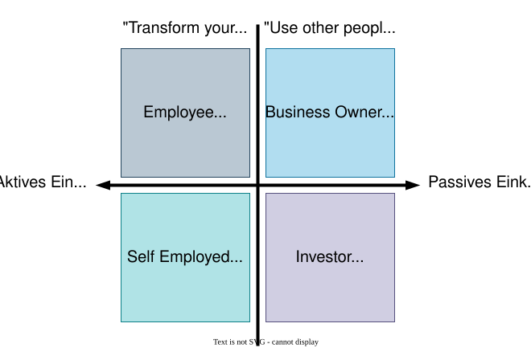
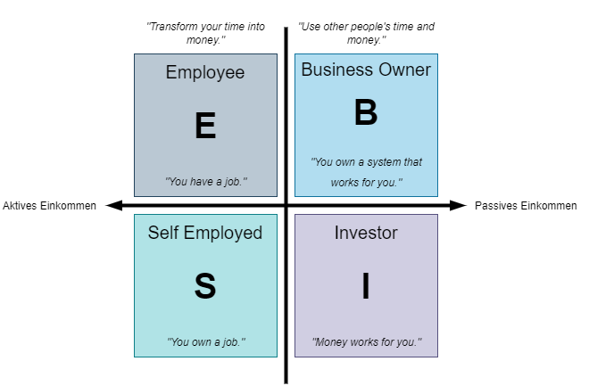

<!--
format:
  html:
    embed-resources: true
lang: de
headlines:
  off: true
extended-content:
  off: true
-->

<!--
title: "DEB Produktentwicklung"
format:
  html:
    embed-resources: true

author:
  - name: "Christian Anders"
    degrees: 
    roles: "Dozent"
    email: christian.anders@hs-esslingen.de
    affiliation: 
      - name: "Hochschule Esslingen"
        department: "Wirtschaft & Technik"
        group: "Digital Engineering (DEB)"
        city: "Esslingen am Neckar"
        postal-code: 73728
        country: "Deutschland"
        url: https://www.hs-esslingen.de/
abstract: > 
  Skript zur Vorlesung und Labor *"Produktentwicklung"* für den Studiengang Digital Engineering DEB
keywords:
  - Produktentstehungsprozess
  - Entwicklungsmethodik
  - Softskills
  - Robert T. Kiyosaki
  - Rich Dad Poor Dad

copyright: 
  holder: Christian Anders
  year: 2026
lang: de
bibliography: Literatur.bib
date: last-modified
toc: true
number-sections: true
scrollable: true
toc-location: right
cap-location: bottom
number-offset: 6
link-external-icon: true
link-external-newwindow: true

headlines:
  off: false
extended-content:
  off: false

format:
  html:
    embed-resources: true
lang: de
bibliography: Literatur.bib
-->

<!-- -------------------------------------------------------------------------

                       Robert T. Kiyosaki "Rich Dad Poor Dad" (1997)

-------------------------------------------------------------------------- -->

::: {.content-visible unless-meta="headlines.off"}
# Softskills
## Persönliche Kompetenzen
:::

### "Rich Dad Poor Dad" (Robert T. Kiyosaki) {#sec-kiyosaki}

::: {.callout-warning}
## Wichtiger Hinweis!
Die folgenden Zeilen zum Cashflow-Quadranten verweisen auf das von weiteren Autoren teils heftig kritisierte, aber gleichwohl millionenfach verkaufte Buch [*"Rich Dad Poor Dad"*](https://en.wikipedia.org/wiki/Rich_Dad_Poor_Dad) des Autors [Robert T. Kiyosaki](https://de.wikipedia.org/wiki/Robert_Kiyosaki). Der geneigte Leser möge sich den von Robert T. Kiyosaki in seinem Bestseller vertretenen Thesen zum Cashflow-Quadranten mit Aufgeschlossenheit, aber auch mit besonderer Vorsicht nähern.
:::

::: {.callout-tip}
## Kernthese: *"Rich Dad Poor Dad"* von Robert T. Kiyosaki (1997)
Finanzielle Freiheit entsteht nicht durch ein hohes Gehalt, sondern durch **finanzielle Bildung**, den **Aufbau von Vermögenswerten** und die Fähigkeit, **Geld für sich arbeiten zu lassen**.
:::

#### Cashflow Quadrant

::: {.callout-tip}
## Definition: *"Cashflow-Quadrant"*
Der Cashflow-Quadrant ist ein von [Robert T. Kiyosaki](https://de.wikipedia.org/wiki/Robert_Kiyosaki) entwickeltes Modell, das vier grundlegende Arten beschreibt, wie Menschen Einkommen erzielen – als Arbeitnehmer (E), Selbstständiger (S), Unternehmer (B) oder Investor (I).
:::

::: {.content-visible unless-meta="fileformat-svg.off"}
{width=72% #fig-cashflowquadrant}
:::
::: {.content-hidden unless-meta="fileformat-svg.off"}
{width=72% #fig-cashflowquadrant}
:::

1. **E – Employee (Arbeitnehmer)**

+ Arbeitet für einen Arbeitgeber gegen Gehalt.
+ Einkommen ist meist linear: Tauscht Zeit gegen Geld.
+ Sicherheit und Stabilität stehen im Vordergrund.

2. **S – Self Employed (Selbstständige/Freiberufler)**

+ Arbeitet für sich selbst.
+ Hat Kontrolle über seine Arbeit, unterliegt aber ebenfalls der *"Tausche-Zeit-gegen-Geld"*-Logik.
+ Einkommen kann schwanken und hängt stark vom persönlichen Einsatz ab.

3. **B – Business Owner (Unternehmer)**

+ Baut ein System (z.B. ein Unternehmen) auf, das (langfristig) auch ohne die eigene Arbeitszeit funktioniert.
+ Nutzt andere Personen (z.B. Mitarbeitende) und/oder das Geld anderer Personen, Strukturen und Abläufe.
+ Einkommen entsteht durch das System (oder das Unternehmen) und die Arbeit/das Geld anderer Personen (z.B. die Arbeit der Mitarbeitenden/das Investment anderer Personen)

4. **I – Investor (Investor)**

+ Lässt Geld (*"Assets"*) für sich arbeiten, z. B. durch Aktien, Staats- und Unternehmensanleihen, Kryptowährungen, Rohstoffe und Edelmetalle, Immobilien.
+ Passives Einkommen, Fokus auf Vermögensaufbau.

<!-- --------------------------------------------------------------------------
EXTENDED CONTENT  -  EXTENDED CONTENT  -  EXTENDED CONTENT  -  EXTENDED CONTENT
S T A R T -->
::: {.content-visible unless-meta="extended-content.off"}
<!-- ---------------------------------------------------------------------- -->

#### Wichtigste Aussagen aus *"Rich Dad Poor Dad"* von Robert T. Kiyosaki (1997)

1. **Unterschiedliche Denkweisen über Geld**

+ *Poor Dad*: *„Mach gute Noten, such dir einen sicheren Job, arbeite hart, sei sparsam.“*
+ *Rich Dad*: *„Lerne, wie Geld funktioniert, investiere, baue Vermögenswerte auf, lass Geld für dich arbeiten.“*

2. **Vermögenswerte vs. Verbindlichkeiten**

+ **Vermögenswerte**: Dinge, die Geld in deine Tasche bringen (z. B. Investitionen, Immobilien, Unternehmen).
+ **Verbindlichkeiten**: Dinge, die Geld aus deiner Tasche nehmen (z. B. Konsumschulden, teure Autos, Eigenheim).
+ Reiche konzentrieren sich auf den Aufbau von Vermögenswerten.

3. **Finanzielle Bildung ist wichtiger als akademische Bildung**

+ Schulen lehren kaum, wie man mit Geld umgeht.
+ Wer finanziell unabhängig werden will, muss sich selbst Wissen über Geld, Investitionen und Unternehmertum aneignen.

4. **Arbeiten, um zu lernen – nicht nur, um Geld zu verdienen**

+ Gehalt ist kurzfristig.
+ Wichtiger ist es, Fähigkeiten aufzubauen (z. B. Verkaufen, Investieren, Unternehmensführung), die langfristig finanzielle Freiheit ermöglichen.

5. **Der Unterschied zwischen Arbeit und Unternehmertum**

+ Arbeitnehmer und Selbständige tauschen Zeit gegen Geld.
+ Unternehmer und Investoren lassen Arbeitnehmer, Selbständige und Kapital für sich arbeiten.

6. **Der Umgang mit Angst und Risiko**

+ Viele Menschen bleiben in Jobs, die sie nicht mögen, weil sie Angst vor finanziellen Unsicherheiten haben.
+ Reiche lernen, Risiken zu managen, statt sie zu vermeiden.

7. **Steuern und Unternehmen als Werkzeuge**

+ Reiche nutzen Unternehmensstrukturen und steuerliche Vorteile, um Einkommen zu schützen und zu vermehren.
+ Arbeitnehmer (und abgeschwächt auch Selbstständige) zahlen oft am meisten Steuern, weil sie keine Strukturen haben, um sie zu optimieren.

<!-- ---------------------------------------------------------------------- -->
:::
<!-- S T O P
EXTENDED CONTENT  -  EXTENDED CONTENT  -  EXTENDED CONTENT  -  EXTENDED CONTENT
--------------------------------------------------------------------------- -->

<!-- -------------------------------------------------------------------------

                       Weiterführende Links

-------------------------------------------------------------------------- -->
<!--
::: {.callout-tip}
## Weiterführende Links
:::
-->

<!-- ---------------------------------------------------------------------- -->
<!--
YOUTUBE  -  YOUTUBE  -  YOUTUBE  -  YOUTUBE  -  YOUTUBE  -  YOUTUBE  -  YOUTUBE
--------------------------------------------------------------------------- -->
<!--

{width=20%}

+ [Robert Kiyosaki: *"Rich Dad's cashflow quadrant"*](https://youtu.be/HJ-Ubr5fFxs)
-->

