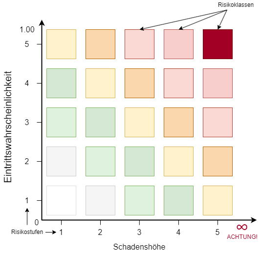

---
format:
  html:
    embed-resources: true
lang: de
bibliography: Literatur.bib
headlines:
  off: true
---

<!--
headlines:
  off: true
extended-content:
  off: false
included-content:
  off: false
worksheets:
  off: true
-->

<!--
title: "DEB Produktentwicklung"
format:
  html:
    embed-resources: true

author:
  - name: "Christian Anders"
    degrees: 
    roles: "Dozent"
    email: christian.anders@hs-esslingen.de
    affiliation: 
      - name: "Hochschule Esslingen"
        department: "Wirtschaft & Technik"
        group: "Digital Engineering (DEB)"
        city: "Esslingen am Neckar"
        postal-code: 73728
        country: "Deutschland"
        url: https://www.hs-esslingen.de/
abstract: > 
  Skript zur Vorlesung und Labor *"Produktentwicklung"* für den Studiengang Digital Engineering DEB
keywords:
  - Risikomanagement
  - Risikomatrix

copyright: 
  holder: Christian Anders
  year: 2025
lang: de
bibliography: Literatur.bib
date: last-modified
toc: true
number-sections: true
scrollable: true
toc-location: right
cap-location: bottom
number-offset: 0
link-external-icon: true
link-external-newwindow: true
-->

<!--
number-offset: 
0 Grundlagen
1 Ideenfindung und Konzeptentwicklung
2 Entwurfs- und Entwicklungsphase
3 Prototyping und Test
4 Produktionsplanung und Produktion
5 Softskills
6 Literatur 
7 Anhang
-->

<!-- -------------------------------------------------------------------------

                       Risikomanagement | Risikomatrix

-------------------------------------------------------------------------- -->

::: {.content-visible unless-meta="headlines.off"}
# Grundlagen
## Methodische Grundlagen
:::

<!-- -------------------------------------------------------------------------

                       Callout !!! WARNING !!!

-------------------------------------------------------------------------- -->
<!--
::: {.callout-warning}
## WARNING!
**THIS CHAPTER IS STILL WORK IN PROGRESS!!!**
:::
-->

### Risikomanagement {#sec-risikomanagement}


::: {.callout-tip}
## Definition: *"Risikomanagement"*
[Risikomanagement](https://de.wikipedia.org/wiki/Risikomanagement) bezeichnet den Prozess der systematischen Identifizierung, Analyse, Bewertung, Behandlung und Überwachung von Risiken im Rahmen eines bestimmten Projekts, Produkts oder Systems. Risikomanagement zielt darauf ab, potenzielle negative Auswirkungen von Risiken zu minimieren oder zu kontrollieren und gleichzeitig Chancen zur Verbesserung zu identifizieren und zu nutzen.
:::

```{mermaid}
%%| label: fig-label-mmrisikomanagment
%%| fig-cap: "Unvollständige Mindmap der Aufgaben des Risikomanagements"
%%{init: {'theme': 'forest'}}%%
mindmap
   root(Risikomanagement)
      (Risikoidentifikation)
      (Risikoanalyse)
      (Risikobewertung)
      (Risikokommunikation)
      (Risikobewältigung)
```


### Risikomatrix {#sec-risikomatrix}

::: {.callout-tip}
## Definition *"Risikomatrix"*
Eine [Risikomatrix](https://de.wikipedia.org/wiki/Risikomatrix) ist eine Methode im Zusammenhang einer [Risikoanalyse](https://de.wikipedia.org/wiki/Risikoanalyse). Sie dient der systematischen Abschätzung und Bewertung von Risiken. Hierzu wird die Wahrscheinlichkeit des Auftretens eines unerwünschten Ereignisses gegenüber dessen Auswirkung tabellarisch ins Verhältnis gesetzt. Die Methode der Risikomatrix ist zumeist Teil eines umfassenderen [Risikomanagements](https://de.wikipedia.org/wiki/Risikomanagement).
:::

::: {.content-visible unless-meta="fileformat-svg.off"}
{width=64% #fig-risikomatrix}
:::
::: {.content-hidden unless-meta="fileformat-svg.off"}
{width=64% #fig-risikomatrix}
:::

::: {.callout-warning}
## ACHTUNG! Vorsicht bei Ereignissen mit extremer ($\infty$) Schadenshöhe!
Bei Ereignissen, denen eine extreme Schadenshöhe zugeschrieben wird kann die Risikomatrix nicht mehr sinnvoll angewendet werden! Bekannte Beispiele finden sich in der Atomtechnik (z.B. Unfälle von [Tschernobyl](Nuklearkatastrophe_von_Tschernobyl) (1986) und [Fukushima](https://de.wikipedia.org/wiki/Nuklearkatastrophe_von_Fukushima) (2011)). 

Eine Ursache hierfür ist, dass aufgrund der stets ungenauen Kenntnis der Eintrittswahrscheinlichkeit extremst seltener Ereignisse (die jedoch stets als größer Null angenommen werden muss da in der Realität kein System existiert das nicht versagen kann) die Multiplikation mit der als quasi $\infty$ angenommenen Schadenshöhe keine sinnvolle Bewertung und Klassifizierung des angenommenen Ereignisses mehr möglich ist.
:::

::: {.callout-tip}
## Pro-Tipp!
Ein in diesen Fällen zumeist praktiziertes Vorgehen ist, den [Erwartungswert](https://de.wikipedia.org/wiki/Erwartungswert) des postulierten Ereignisses nach bestem Stand der Erkenntnis abzuschätzen und mit einem bekannten und breit akzeptierten Erwartungswerts zu vergleichen. Beispielsweise gelten fahrerlose Assistenzsysteme als akzeptabel, wenn es gelingt die Systeme so zu ertüchtigen, dass von Assistenzsystemen gesteuerten Fahrzeuge im Mittel weniger Schaden verursachen als Fahrzeuge, die von Personen gesteuert werden.
:::


Anwendung findet die Risikomatrix auch bei der Gefährdungsbeurteilung für die Ausstattung, die in Entwicklungsbereichen und Werkstätten zur Produktentwicklung, ebenso für die Gefährdungsbeurteilung der Werkzeuge, Maschinen und Anlagen in Produktions- und Instandhaltungsbereichen. Der geneigte Leser wird der Risikomatrix mit hoher Wahrscheinlichkeit früher oder später in seinem Berufsleben auf die eine oder andere Art begegnen.


### Risikoprioritätszahl (RPZ) {#sec-rpz}

::: {.callout-tip}
## Definition *"Risikoprioritätszahl (RPZ)"*
Die Risikoprioritätszahl (RPZ) (engl. Risk Priority Number ([RPN](https://en.wikipedia.org/wiki/Failure_mode_and_effects_analysis#Basic_terms))) ist ein quantitativer, dimensionsloser Kennwert, mit dem das Risiko eines potenziellen Risikos oder Fehlers bewertet und priorisiert werden kann.
:::

Die Risikoprioritätszahl (RPZ) findet unter anderem als zentrales Konzept bei der [Fehler-Möglichkeits- und Einfluss-Analyse](https://de.wikipedia.org/wiki/FMEA) (FMEA) (engl. Failure Mode and Effects Analysis) (siehe → FMEA @sec-fmea) Verwendung.

Die RPZ ergibt sich aus den drei Faktoren Bedeutung B (Severity), Auftretenswahrscheinlichkeit A (Occurrence) und (optional, je nach Anwendungsfall) Entdeckungswahrscheinlichkeit E (Detection):

$$RPZ = B × A × E$$

| Kürzel | Bedeutung                                     | Beschreibung                                             | Skala (typisch 1–10)                                |
| :----- | :-------------------------------------------- | :------------------------------------------------------- | :-------------------------------------------------- |
| B      | Bedeutung (Severity)                          | Wie schwerwiegend sind die Auswirkungen des Fehlers?     | 1 = unbedeutend, 10 = katastrophal                  |
| A      | Auftretenswahrscheinlichkeit (Occurrence)     | Wie wahrscheinlich ist das Auftreten des Fehlers?        | 1 = sehr unwahrscheinlich, 10 = sehr wahrscheinlich |
| E      | Entdeckungswahrscheinlichkeit (Detection)     | Wie gut kann der Fehler entdeckt werden, bevor er wirkt? | 1 = sehr gut erkennbar, 10 = sehr schwer erkennbar  |

: Faktoren zur Berechnung der Risikoprioritätszahl RPZ im Rahmen einer [FMEA](https://de.wikipedia.org/wiki/FMEA)  {#tbl-faktorenrpz .striped .hover .bordered}

::: {.callout-tip}
## Pro-Tipp!
Bei der Verwendung der Risikoprioritätszahl im Rahmen einer Risikomatrix bei der Produktentwicklung oder einer Gefährdungsbeurteilung wird der Faktor Entdeckungswahrscheinlichkeit E stets als 1 gesetzt, gleichbedeutend mit der Annahme dass jedes Risiko, das eintreten kann, früher oder später auch eintreten wird (siehe → [Murphy's Gesetz](https://de.wikipedia.org/wiki/Murphys_Gesetz) @sec-murphyslaw)
:::
