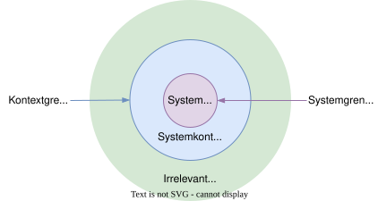
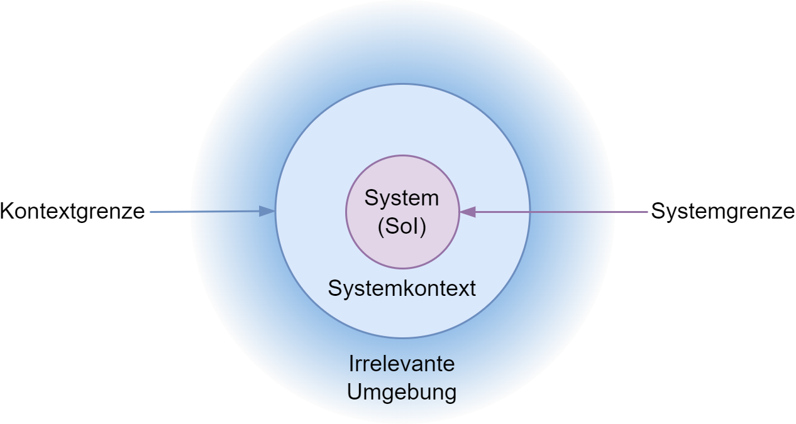

<!--
format:
  html:
    embed-resources: true
lang: de
bibliography: Literatur.bib
headlines:
  off: true
extended-content:
  off: true
fileformat-svg:
  off: true
-->

<!--
title: "DEB Produktentwicklung"
format:
  html:
    embed-resources: true

author:
  - name: "Christian Anders"
    degrees: 
    roles: "Dozent"
    email: christian.anders@hs-esslingen.de
    affiliation: 
      - name: "Hochschule Esslingen"
        department: "Wirtschaft & Technik"
        group: "Digital Engineering (DEB)"
        city: "Esslingen am Neckar"
        postal-code: 73728
        country: "Deutschland"
        url: https://www.hs-esslingen.de/
abstract: > 
  Skript zur Vorlesung und Labor *"Produktentwicklung"* für den Studiengang Digital Engineering DEB
keywords:
- Produktentstehungsprozess
- Entwicklungsmethodik
- System of Interest (SoI)

copyright: 
  holder: Christian Anders
  year: 2025
lang: de
bibliography: Literatur.bib
date: last-modified
toc: true
number-sections: true
scrollable: true
toc-location: right
cap-location: bottom
number-offset: 6
link-external-icon: true
link-external-newwindow: true

headlines:
  off: false
extended-content:
  off: false
-->

<!--
headlines:
  off: true
extended-content:
  off: false
included-content:
  off: false
worksheets:
  off: false
exercises:
  solutions:
    on: true 
fileformat-svg:
  off: true
-->

<!--
number-offset: 
0 Grundlagen
1 Ideenfindung und Konzeptentwicklung
2 Entwurfs- und Entwicklungsphase
3 Prototyping und Test
4 Produktionsplanung und Produktion
5 Softskills
6 Literatur 
7 Anhang
-->

<!-- -------------------------------------------------------------------------

                       Callout !!! WARNING !!!

-------------------------------------------------------------------------- -->
<!--
::: {.callout-warning}
## WARNING!
**THIS DOCUMENT IS WORK IN PROGRESS!!!**
:::
-->

::: {.content-visible unless-meta="headlines.off"}
# Grundlagen
## Methodische Grundlagen
:::

<!-- -------------------------------------------------------------------------

                       System

-------------------------------------------------------------------------- -->

### System {#sec-system}

::: {.callout-tip}
## Definition *"System"*
Ein System ist eine geordnete Menge von miteinander in Wechselwirkung stehenden Elementen, die gemeinsam eine bestimmte Funktion oder ein Ziel erfüllen und durch eine definierte Systemgrenze von ihrer Umgebung abgegrenzt sind.
:::

::: {.content-visible unless-meta="fileformat-svg.off"}
{width=64% #fig-system}
:::
::: {.content-hidden unless-meta="fileformat-svg.off"}
{width=64% #fig-system}
:::

<!--
## System (Folie MSchlipf_VL3Anfoderungen31)
 
Thermodynamik: (A. Frohn, Einführung in die technische Thermodynamik)
 „Die Substanz, die Gegenstand einer thermodynamischen Untersuchung ist, wird als System bezeichnet. […]

Der Bereich außerhalb des Systems wird Umgebung genannt. Die Grenzen des Systems können als gedachte Grenzen eingeführt werden, sie können aber auch mir realen Begrenzungsflächen zusammenfallen […]

Man kann zwar die Systemgrenzen frei bestimmen, durch eine geeignete Wahl der Systemgrenzen wird aber häufig die Beantwortung einer bestimmten Fragestellung entscheidend vereinfacht.“

Definition des System of Interest (SoI)
+ Systemgrenzen → Inhalt = SoI
+ Einordnung SoI in SoS: welche Nachbarsysteme sind zu beachten?
+ Abgrenzung des Projektes

+ Systemgrenze  → Definiert, welche Aspekte durch das geplante System abgedeckt werden sollen und welche Aspekte nur Teil der Umgebung dieses Systems sind
+ Systemkontext  →  Liegt zwischen Systemgrenze und Kontextgrenze, ist relevant für das Verständnis und die Definition der Anforderungen an das System und kann im Rahmen der Entwicklung des Systems nicht bzw. kaum mitgestaltet werden; beeinflusst geplantes System
+ Kontextgrenze  → Grenze des Kontexts zur irrelevanten Umgebung hin (Kontextabgrenzung); schließt alles aus, was keine relevante Beziehung zu dem System hat
+ Irrelevante Umgebung  →  Aspekte, die keine relevante Beziehung zum geplanten System haben, hat keinen Einfluss auf Entwicklung des geplanten Systems.

::: {.callout-important}
## Pro-Tipp
Grenzen sind nicht immer eindeutig bestimmbar und werden im Verlauf der Systementwicklung präzisiert und werden an den Erkenntnisfortschritt angepasst.
:::
-->

<!-- ChatGPT4.0
Ja, im Zusammenhang mit Systemen steht die Abkürzung **SoI** für **"System of Interest"**.  

### **Bedeutung von SoI (System of Interest):**  
Das *System of Interest* ist das System, das in einer bestimmten Analyse, Entwicklung oder Untersuchung betrachtet wird. Es ist der zentrale Fokus innerhalb eines Systems Engineering-Prozesses oder einer Systemanalyse.  

### **Abgrenzung zu verwandten Begriffen:**  
- **Wider Systemkontext:** Das SoI existiert oft innerhalb eines größeren *System of Systems (SoS)*.  
- **Systemumgebung:** Das SoI interagiert mit externen Systemen, Stakeholdern oder Umwelteinflüssen.  
- **Subsysteme:** Das SoI kann selbst aus mehreren Subsystemen bestehen, die zusammen eine Funktion erfüllen.  

### **Anwendungsbereiche:**  
+ *Systems Engineering (z. B. nach INCOSE oder ISO/IEC 15288)*  
+ *Komplexe technische Systeme (z. B. Luft- und Raumfahrt, Automobil, IT-Systeme)*  
+ *Modellbasierte Systementwicklung (MBSE)*  

## SoI

Im Kontext des **Produktentwicklungsprozesses** bezeichnet der Begriff **SoI (System of Interest)** dasjenige System, das im Fokus der Produktentwicklung steht und für das Anforderungen definiert, entworfen, realisiert, getestet und schließlich in den Betrieb überführt werden.  

### **Definition:**  
Das *System of Interest (SoI)* ist das betrachtete System innerhalb des Produktentwicklungsprozesses. Es umfasst die relevanten Komponenten, Funktionen und Schnittstellen, die entwickelt und integriert werden müssen, um die gewünschten Anforderungen zu erfüllen.  

### **Merkmale des SoI in der Produktentwicklung:**  
+ **Abgegrenzter Fokus:** Das SoI ist das System, das entwickelt wird, nicht die gesamte Systemlandschaft.  
+ **Dynamische Definition:** Das SoI kann sich in verschiedenen Entwicklungsphasen ändern (z. B. von einer technischen Komponente hin zum Gesamtsystem).  
+ **Interaktion mit Umgebung:** Es steht in Wechselwirkung mit anderen Systemen, Nutzern und Umwelteinflüssen.  
+ **Hierarchische Struktur:** Es kann aus Subsystemen bestehen oder Teil eines *System of Systems (SoS)* sein.  

### **SoI im Entwicklungsprozess (nach Systems Engineering-Ansatz):**  
1. **Anforderungsanalyse:** Klärung der Stakeholder-Bedürfnisse und Ableitung der SoI-Funktionalitäten.  
2. **Systemarchitektur:** Definition der Systemstruktur, der Subsysteme und Schnittstellen.  
3. **Detailliertes Design & Implementierung:** Entwicklung und Verfeinerung der technischen Lösungen.  
4. **Validierung & Verifikation:** Sicherstellen, dass das SoI spezifikationsgerecht funktioniert.  
5. **Betrieb & Wartung:** Das SoI wird in seinen realen Nutzungskontext überführt und ggf. weiterentwickelt.  

### **Beispiel: SoI in der Automobilentwicklung**  
- **SoI auf Fahrzeugebene:** Das gesamte Auto als entwickeltes Produkt.  
- **SoI als Teilsystem:** Nur das Infotainmentsystem oder das Fahrassistenzsystem.  
- **SoI als Komponente:** Eine spezifische ECU (Electronic Control Unit) innerhalb eines Fahrzeugsystems.  

## SoS

Im Kontext des **Produktentwicklungsprozesses** und des **Systems Engineering** steht die Abkürzung **SoS (System of Systems)** für ein übergeordnetes, aus mehreren interagierenden Einzelsystemen bestehendes Gesamtsystem.  

### **Definition:**  
Ein *System of Systems (SoS)* ist eine Konstellation aus mehreren unabhängigen, aber kooperierenden **Systemen**, die zusammen eine übergeordnete Funktion oder einen Mehrwert erzeugen, den die einzelnen Systeme allein nicht bieten könnten.  

### **Merkmale eines SoS:**  
+ **Jedes Teilsystem ist eigenständig** – Die einzelnen Systeme (Sub-Systeme) können unabhängig existieren und operieren.  
+ **Dynamische Interaktionen** – Die Beziehungen zwischen den Systemen können sich über die Zeit verändern.  
+ **Verteilte Kontrolle** – Es gibt oft keine zentrale Steuerung, sondern eine koordinierte Zusammenarbeit der Systeme.  
+ **Emergente Eigenschaften** – Das SoS kann Eigenschaften haben, die nicht allein aus der Summe der Einzelsysteme ableitbar sind.  
+ **Interoperabilität notwendig** – Die Systeme müssen über definierte Schnittstellen und Protokolle zusammenarbeiten.  

### **SoS im Produktentwicklungsprozess**  
1. **Identifikation des SoS:** Definition des übergeordneten Systems, das aus mehreren Teilsystemen besteht.  
2. **Abgrenzung des *System of Interest (SoI)*:** Das SoI ist ein spezifisches System innerhalb des SoS, das entwickelt oder analysiert wird.  
3. **Systemintegration:** Sicherstellen, dass das SoI mit anderen Systemen innerhalb des SoS kompatibel ist.  
4. **Test & Validierung:** Überprüfung der Gesamtfunktionalität des SoS inklusive Wechselwirkungen zwischen den Systemen.  

### **Beispiele für SoS in der Produktentwicklung**  
- **Automobilindustrie:** Ein vernetztes Fahrzeug, das mit anderen Fahrzeugen, Verkehrsinfrastruktur und Cloud-Diensten kommuniziert.  
- **Luft- und Raumfahrt:** Ein Flottenmanagementsystem, das verschiedene Flugzeuge, Satelliten und Bodenstationen integriert.  
- **Smart Cities:** Ein intelligentes Verkehrssystem, das Ampeln, Fahrzeuge, Navigationssysteme und öffentliche Verkehrsmittel miteinander verbindet.  

### **Abgrenzung SoI vs. SoS**  
| **Begriff** | **Bedeutung** |
|------------|--------------|
| **System of Interest (SoI)** | Das betrachtete System innerhalb einer Entwicklung oder Analyse |
| **System of Systems (SoS)** | Eine übergeordnete Struktur aus mehreren kooperierenden, eigenständigen Systemen |

Die **Grenze zwischen SoI (System of Interest) und SoS (System of Systems)** wird durch den **Fokus der Analyse und Entwicklung** sowie durch die **Grad der Unabhängigkeit der Systeme** bestimmt.  

### **Definition der Grenze zwischen SoI und SoS:**  
1. **System of Interest (SoI):**  
   - Das System, das im aktuellen Entwicklungs- oder Analysefokus steht.  
   - Wird aktiv entworfen, entwickelt, getestet oder optimiert.  
   - Besteht oft aus mehreren Subsystemen, die gemeinsam eine definierte Funktion erfüllen.  
   - **Beispiel:** Ein neues Fahrerassistenzsystem, das entwickelt wird.  

2. **System of Systems (SoS):**  
   - Eine übergeordnete Struktur, die aus mehreren, eigenständigen Systemen besteht.  
   - Jedes Teilsystem kann unabhängig existieren und eigene Entwicklungszyklen haben.  
   - Die Systeme interagieren miteinander, um einen zusätzlichen Mehrwert zu erzeugen.  
   - **Beispiel:** Ein vernetztes Verkehrsmanagementsystem, in dem mehrere Fahrerassistenzsysteme unterschiedlicher Fahrzeuge miteinander kommunizieren.  

### **Wichtige Unterscheidungskriterien:**  

| Kriterium         | SoI (System of Interest) | SoS (System of Systems) |
|-------------------|--------------------------|--------------------------|
| **Fokus**         | Betrachtetes System in der Entwicklung oder Analyse | Übergeordnetes System mit mehreren eigenständigen Systemen |
| **Unabhängigkeit** | Besteht aus Subsystemen, die nicht autonom sind | Besteht aus eigenständigen Systemen mit eigenen Zielen |
| **Steuerung**     | Einheitlich geführt und entwickelt | Dezentrale Steuerung mit Koordination der Teilsysteme |
| **Interaktion**   | Definierte Schnittstellen zu seiner Umgebung | Dynamische Wechselwirkungen zwischen Systemen |
| **Beispiel Automobil** | Ein einzelnes Fahrzeugmodell oder Assistenzsystem | Ein vernetztes Verkehrssystem mit Fahrzeug-zu-Fahrzeug-Kommunikation |

### **Wann ist ein System ein SoI und wann Teil eines SoS?**  
- **Ein System ist ein SoI, wenn es aktiv entwickelt oder analysiert wird.**  
- **Dasselbe System kann jedoch ein Teilsystem eines SoS sein, wenn es mit anderen Systemen in einem übergeordneten Kontext interagiert.**  
- **Die Grenze ist nicht fix, sondern hängt von der betrachteten Perspektive ab.**  

### **Beispiel zur Abgrenzung:**  
**Autonomes Fahrzeug in einer Smart City**  
- Entwickeln Ingenieure das **autonome Fahrsystem** eines Autos? → **Das Fahrzeug ist das SoI.**  
- Betrachten sie das gesamte **intelligente Verkehrsnetz**, das viele Fahrzeuge, Ampeln und Sensoren verbindet? → **Dann ist es ein SoS.**  

## System (Folie MSchlipf_VL3Anfoderungen32)

Für erfolgreiche und zielgerichtete Anforderungsermittlung, sollte man sich vor der Anforderungserhebung folgende 3 Fragen stellen:

1. Was soll Teil des Systems sein?  → Das, was spezifiziert werden muss
2. Was soll nicht Teil des Systems sein?  → Das, was nicht spezifiziert werden muss
3. Was hat direkten Bezug zu dem System? → Das, was beim Spezifizieren berücksichtigt werden muss

Wichtig: Begriff „System“ erfordert für jeden Bereich eine eigene Definition, weil der Betrachtungsgegenstand unterschiedlich ist.

-->

