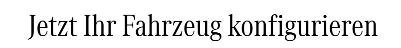

<!--
format:
  html:
    embed-resources: true
lang: de
bibliography: Literatur.bib
headlines:
  off: true
extended-content:
  off: true
-->

<!--
title: "DEB Produktentwicklung"
format:
  html:
    embed-resources: true

author:
  - name: "Christian Anders"
    degrees: 
    roles: "Dozent"
    email: christian.anders@hs-esslingen.de
    affiliation: 
      - name: "Hochschule Esslingen"
        department: "Wirtschaft & Technik"
        group: "Digital Engineering (DEB)"
        city: "Esslingen am Neckar"
        postal-code: 73728
        country: "Deutschland"
        url: https://www.hs-esslingen.de/
abstract: > 
  Skript zur Vorlesung und Labor *"Produktentwicklung"* für den Studiengang Digital Engineering DEB
keywords:
  - Produktentstehungsprozess
  - Entwicklungsmethodik
  - Variantenkonstruktion
  - Coderegel

copyright: 
  holder: Christian Anders
  year: 2026
lang: de
bibliography: Literatur.bib
date: last-modified
toc: true
number-sections: true
scrollable: true
toc-location: right
cap-location: bottom
number-offset: 2
link-external-icon: true
link-external-newwindow: true

headlines:
  off: false
extended-content:
  off: false
-->

<!--
number-offset: 
0 Grundlagen
1 Ideenfindung und Konzeptentwicklung
2 Entwurfs- und Entwicklungsphase
3 Prototyping und Test
4 Produktionsplanung und Produktion
5 Softskills
6 Literatur 
7 Anhang
-->


::: {.content-visible unless-meta="headlines.off"}
# Entwurf und Entwicklung
## Produktdokumentation
:::

<!-- -------------------------------------------------------------------------

                       Variantenkonstruktion

-------------------------------------------------------------------------- -->
### Variantenkonstruktion {#sec-variantenkonstruktion}


::: {.callout-tip}
## Definition: *"Variantenkonstruktion"*
Die Variantenkonstruktion ist ein systematischer Konstruktionsansatz, bei dem ausgehend von einer Grundstruktur eines Produkts durch die gezielte Kombination von Komponenten unterschiedliche Produktvarianten effizient entwickelt und abgeleitet werden können.
:::

::: {.callout-tip}
## Definition: *"Variantencode"*
Ein Variantencode ist eine eindeutige, meist alphanumerische Kennzeichnung, die die Kombination spezifischer Merkmalsausprägungen eines Produkts beschreibt und damit eine bestimmte Produktvariante eindeutig identifiziert.
:::

::: {.callout-tip}
## Definition: *"Ecktyp"*
Ein Ecktyp ist eine exemplarische Produktvariante, die eine eindeutige Kombination von Merkmalsausprägungen repräsentiert und als Referenz- oder Ausgangspunkt für die Ableitung weiterer Produktvarianten innerhalb einer Produktfamilie dient.
:::

In der Variantenkonstruktion werden Ecktypen verwendet, um den Variantenraum systematisch zu beschreiben.
Ecktypen werden dabei in der Regel so gewählt, dass sie die Extrem- oder Grenzkombinationen der wichtigsten Merkmale abbilden^[In der Automobilindustrie z.B. die als *"Schwabenvariante"* bezeichnete Konfiguration eines Fahrzeugs, gemeint ist in der Regel die preiswerteste Fahrzeugkonfiguration ohne jegliche aufpreispflichtige Ausstattung.].
<!-- -------------------------------------------------------------------------

                       Coderegel

-------------------------------------------------------------------------- -->

### Coderegel {#sec-coderegel}

---

>
***"Variantenlogik statt Variantenchaos"*** (Mission-Statement bei der Verwendung von Coderegeln)

---

::: {.callout-tip}
## Definition: *"Coderegel"*
Eine Coderegel beschreibt die formale Zuordnung von Merkmalsausprägungen zu einer Produktvariante anhand eines Variantencodes (*"Code"*). Eine Coderegel beschreibt, welche Komponente aktiv/inaktiv sind, wenn eine bestimmte Kombination aus Codes vorliegt.
:::

Die Coderegel beschreibt dabei welche Merkmalsausprägungen zulässig sind, wie die Merkmalsausprägungen miteinander kombiniert werden können/dürfen und wie sie in der Produktstruktur (BOM, CAD, PLM) abgebildet werden. 

Einsatzgebiete sind u.a. die Baubarkeitsprüfung einer Produktvariante, die automatische Stücklistenerzeugung in PLM/PDM-Systemen oder auch die Produktvisualisierung.


<!-- --------------------------------------------------------------------------
EXTENDED CONTENT  -  EXTENDED CONTENT  -  EXTENDED CONTENT  -  EXTENDED CONTENT
S T A R T
<!-- ---------------------------------------------------------------------- ---

::: {.callout-note}
## Anwendungsbeispiel: Produktvisualisierung mittels Variantencodes und Coderegeln
[{width=56% #fig-mbpkwkonfigurator}](https://www.mercedes-benz.de/passengercars/configurator.html)
:::

<!-- ---------------------------------------------------------------------- ---
<!-- S T O P
EXTENDED CONTENT  -  EXTENDED CONTENT  -  EXTENDED CONTENT  -  EXTENDED CONTENT
--------------------------------------------------------------------------- -->


::: {.callout-important}
## Pro-Tipp!
Jegliche Variantenkonstruktion ist ohne die Verwendung von Coderegeln nahezu unmöglich. Die Verwendung von Coderegeln ist dabei nicht auf **Produkthardware** beschränkt sondern schließt **weitere Merkmale** (z.B. Farben) sowie **Soft- und Firmware** explizit mit ein um mögliche Inkonsistenzen zwischen Mechanik, Elektrik und Software zu vermeiden
:::

Coderegeln werden in der Regel in PLM/PDM-Systemen als logische Produktstruktur (***"150%-BOM"***) gepflegt. Jede potenziell im Produkt verwendete Komponente besitzt Gültigkeitsbedingungen. Der Konfigurator des PLM/PDM-Systems erzeugt dann bei gegebenen Variantencodes eine *"100%-Variante"* (z.B. im CAD, Stückliste/BOM, Soft- und Firmware).

::: {.callout-important}
## Pro-Tipp!
Das erstmalige Erstellen und insbesondere die den gesamten Produktentstehungsprozess begleitende Pflege von Coderegeln ist mit erheblichstem Aufwand verbunden und kann vom geneigten Leser keinesfalls überschätzt werden!
::: 

<!-- -------------------------------------------------------------------------

                       Anwendungsbeispiel Variantencodes und Coderegeln

-------------------------------------------------------------------------- -->
::: {.callout-note}
## Anwendungsbeispiel: Variantencodes und Coderegeln

Fallbeispiel: Ein Fahrzeug kann in zwei Varianten gebaut werden:

1. mit Elektromotor (E-Motor)
2. mit Verbrennungsmotor (V-Motor)

Welcher Motor in einem Fahrzeug verbaut wird soll über einen Variantencode und ein Bool’sches Merkmal $E$ gesteuert werden.

| Kürzel | Bedeutung            | Typ        | Beschreibung                        |
| ------ | -------------------- | ---------- | ----------------------------------- |
| $E$    | Elektroantrieb aktiv | Bool (0/1) | steuert, ob Fahrzeug elektrisch ist |

* $E = 1$ → Elektromotor
* $E = 0$ → Verbrennungsmotor

Die booleschen Coderegeln lauten dann (in logischer Form, neutral formuliert):

| Regel-ID | Bedingung (Bool-Ausdruck) | Aktion im CAD-System                | Beschreibung               |
| -------- | ------------------------- | ----------------------------------- | -------------------------- |
| R1       | $E = 1$                   | aktiviere „Elektromotor.prt“        | E-Motor einbauen           |
| R2       | $E = 1$                   | deaktiviere „Verbrennungsmotor.prt“ | kein V-Motor bei E-Antrieb |
| R3       | $E = 0$                   | aktiviere „Verbrennungsmotor.prt“   | V-Motor einbauen           |
| R4       | $E = 0$                   | deaktiviere „Elektromotor.prt“      | kein E-Motor bei V-Antrieb |


In reiner Bool’scher Logik formuliert:

* Elektromotor aktiv:
  ( $M_E = E$ )
* Verbrennungsmotor aktiv:
  ( $M_V = \neg E$ )

wobei

* ( $M_E$ ) = Wahr, wenn Elektromotor verwendet wird
* ( $M_V$ ) = Wahr, wenn Verbrennungsmotor verwendet wird
* ( $\neg E$ ) = Negation von $E$


In der Praxis wird meist ein Variantencode wie z.B. `DRIVE=E` oder `DRIVE=C` verwendet.

| Variantencode | Bedeutung       | Bool-Wert $E$ | Motor             |
| ------------- | --------------- | ------------- | ----------------- |
| `DRIVE=E`     | Elektrofahrzeug | 1             | Elektromotor      |
| `DRIVE=C`     | Verbrenner      | 0             | Verbrennungsmotor |

Dann lauten die Coderegeln (oftmals auch als *"kurze Coderegel"* bezeichnet):

```text
IF DRIVE = "E" THEN INCLUDE("Elektromotor.prt");
IF DRIVE = "C" THEN INCLUDE("Verbrennungsmotor.prt");
```

oder als kombinierte Coderegeln (oftmals auch als *"lange Coderegel"* bezeichnet):

```text
IF DRIVE = "E" THEN
    INCLUDE("Elektromotor.prt");
    EXCLUDE("Verbrennungsmotor.prt");
ELSE
    INCLUDE("Verbrennungsmotor.prt");
    EXCLUDE("Elektromotor.prt");
ENDIF
```

Aufbauend auf dieser Grundlage aus Variantencodes und Coderegeln kann dieselbe Bool’sche Steuerung automatisch auch weitere vom gewählten Antrieb abhängige Komponenten regeln:

```text
IF E THEN
    INCLUDE("Batterie.prt");
    EXCLUDE("Tank.prt");
ELSE
    INCLUDE("Tank.prt");
    EXCLUDE("Batterie.prt");
ENDIF
```

Vorteil: Durch dieses Vorgehen bleibt die Regelbasis stets konsistent: Eine einzige Bool-Variable ($E$) bzw. die Vorgabe eines Variantencodes (`DRIVE=E`) steuert alle Komponenten entlang des Antriebsystems des im Fallbeispiel angenommenen Fahrzeugs. 

<!--
::: {.callout-warning}
## Variantencodes und Coderegeln sind fundamental für die Entwicklung moderner technischer Produkte!
-->
In der Praxis moderner technischer Produkte - bestehend aus tausenden von mechanischen und elektrischen Komponenten, Softwareständen und ggf. Firmwareständen - sind die Coderegeln in ihrem Zusammenspiel überaus komplex und müssen dabei die Gesamtheit aller Wechselwirkungen zwischen Variantencodes und im Produkt zu verbauenden Komponenten vollständig und widerspruchsfrei über den gesamten Produktentstehungsprozess und oftmals weit darüber hinaus abbilden.
:::

<!-- -------------------------------------------------------------------------

                       Weiterführende Links + Literaturempfehlung

-------------------------------------------------------------------------- -->
<!--
::: {.callout-tip}
## Weiterführende Links

:::
-->


::: {.callout-tip}
## Weiterführende Sharable-Links (Springer-Verlag)

+ @juhl_technische_2015: [Technische Dokumentation](https://rdcu.be/dKtdV)

:::


<!--
#### Literaturempfehlung

](images/Juhl_Technische_Dokumentation_978-3-662-46865-4.webp){width=40%}

-->

