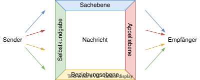
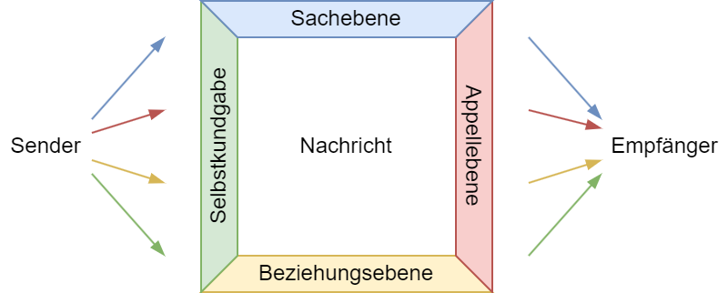

<!--
title: "DEB Produktentwicklung"
format:
  html:
    embed-resources: true

author:
  - name: "Christian Anders"
    degrees: 
    roles: "Dozent"
    email: christian.anders@hs-esslingen.de
    affiliation: 
      - name: "Hochschule Esslingen"
        department: "Wirtschaft & Technik"
        group: "Digital Engineering (DEB)"
        city: "Esslingen am Neckar"
        postal-code: 73728
        country: "Deutschland"
        url: https://www.hs-esslingen.de/
abstract: > 
  Skript zur Vorlesung und Labor *"Produktentwicklung"* für den Studiengang Digital Engineering DEB
keywords:
  - Produktentstehungsprozess
  - Entwicklungsmethodik
  - Softskills
  - Vier-Seiten-Modell
  - Kommunikationsquadrat

copyright: 
  holder: Christian Anders
  year: 2026
lang: de
bibliography: Literatur.bib
date: last-modified
toc: true
number-sections: true
scrollable: true
toc-location: right
cap-location: bottom
number-offset: 6
link-external-icon: true
link-external-newwindow: true

headlines:
  off: false
extended-content:
  off: false
-->

<!-- -------------------------------------------------------------------------

                       Vier-Seiten-Modell (Schulz von Thun)

-------------------------------------------------------------------------- -->

::: {.content-visible unless-meta="headlines.off"}
# Softskills
## Kooperation und Kollaboration
:::

### Vier-Seiten-Modell (Schulz von Thun) {#sec-vierseitenmodell}

::: {.callout-tip}
## Definition: *"Vier-Seiten-Modell"*
Das [Vier-Seiten-Modell](https://de.wikipedia.org/wiki/Vier-Seiten-Modell) ist ein Modell der [Kommunikationspsychologie](https://de.wikipedia.org/wiki/Kommunikationspsychologie) von [Friedemann Schulz von Thun](https://de.wikipedia.org/wiki/Friedemann_Schulz_von_Thun). Das Vier-Seiten-Modell wurde 1981 veröffentlicht. Es geht davon aus, dass jede Äußerung vier Botschaften enthält oder auf vier verschiedenen Wegen verstanden werden kann. Das Vier-Seiten-Modell wird auch als "Vier-Ohren-Modell", "Nachrichtenquadrat" oder "Kommunikationsquadrat" bezeichnet.
:::

Nach dem Vier-Seiten-Modell besteht eine Nachricht aus vier Botschaften. Friedemann Schulz von Thun spricht von den *"4 Seiten einer Nachricht"* und stellt sie vierfarbig als Quadrat dar. Jeder der vier Seiten einer Nachricht vermittelt eine andere Botschaft. Schulz von Thun ordnet den Botschaften je eine Farbe und Bedeutung zu. In dem Kommunikationsquadrat entspricht das folgenden Ebenen:

🔵 Sachebene: Worüber informiert der Sender?

🔴 Appellebene: Was will der Sender vom Empfänger?

🟡 Beziehungsebene: Wie steht der Sender zum Empfänger?

🟢 Selbstkundgabe: Was gibt der Sender von sich preis?

Wenn Personen miteinander kommunizieren sendet der Sender **immer Botschaften auf den vier Ebenen**. Der Empfänger nimmt die Botschaft **auf allen vier Ebenen** auf. Passen die auf den vier Ebenen gesendeten Botschaften nicht zusammen, kommt es zwischen Sender und Empfänger zu unterschiedlichen Interpretationen der Nachricht und im Folgenden zu Missverständnissen, die sich zu erheblichen Konflikten ausweiten können.

::: {.content-visible unless-meta="fileformat-svg.off"}
{width=68% #fig-vierseitenmodell}
:::
::: {.content-hidden unless-meta="fileformat-svg.off"}
{width=68% #fig-vierseitenmodell}
:::

::: {.callout-note}
## 🔵 Blau → Sachebene     🟡 Gelb → Beziehungsebene
Die von Friedemann Schulz von Thun verwendeten Farben sind heute im Bereich Personalwesen, Team- und Organisationsentwicklung zu Synonymen für die vier Ebenen geworden, so dass in Unternehmen von *"Blauen Themen"* oder *"Gelben Themen"* gesprochen wird und implizit davon ausgegangen wird, dass es Allgemeinwissen sei, dass insbesondere 🔵 Blau für die Sachebene und 🟡 Gelb für die Beziehungsebene steht.
:::

<!-- --------------------------------------------------------------------------
EXTENDED CONTENT  -  EXTENDED CONTENT  -  EXTENDED CONTENT  -  EXTENDED CONTENT
S T A R T -->
::: {.content-visible unless-meta="extended-content.off"}
<!-- ---------------------------------------------------------------------- -->

#### Sachebene (Farbe: Blau 🔵)

Auf der Sachebene werden Fakten und Daten kommuniziert. Hört der Empfänger auf der Sachebene, fragt er sich, welche Informationen der Sender durch die Nachricht übermittelt. Er prüft, ob die übermittelten Informationen, Daten und Fakten und bewertet diese je nach Sachverhalt.

Um Irritationen zu vermeiden, sollte sich der Sprecher möglichst sachlich, präzise und zweifelsfrei ausdrücken. Je nach anschließender Bewertung reagiert der Empfänger auf diese Sach-Botschaften: Wahr oder unwahr? Zutreffend oder unzutreffend? Relevant oder irrelevant? Ausreichend oder lückenhaft?

::: {.callout-tip}
## Tipp
Fragen Sie unbedingt nach wenn Sie als Empfänger einen kommunizierten Sachverhalt nicht verstanden haben!
:::

#### Selbstkundgabe (Farbe: Grün 🟢)
Diese Seite der Botschaft ist dem Sprecher oft nicht klar. Egal, was man sagt, man gibt immer etwas über sich und die eigene Persönlichkeit preis. Zum Beispiel eigene Emotionen, Werte, Ansichten und Bedürfnisse. (*"Was Peter über Paul sagt, sagt mehr über Peter als über Paul."*)

Diese Selbstkundgabe kann gewollt sein. Häufiger aber geschieht die Selbstkundgabe implizit und unbewusst durch Wortwahl, Betonung, Gestik und Mimik. So spürt der Empfänger, dass zwischen den Zeilen mehr mitschwingt (siehe → [Johari-Fenster](https://de.wikipedia.org/wiki/Johari-Fenster))

#### Beziehungsebene (Farbe: Gelb 🟡)
Auf der Beziehungsebene erfährt der Empfänger, wie der Sender zu ihr oder ihm steht. Auch hier unterstützt die Körpersprache das Gesagte.

Studien kommen zu dem Ergebnis, dass Worte weit weniger Gewicht in der Kommunikation haben als Gestik, Mimik und Körpersprache. Diese sind aber für die Beziehungsseite sehr wichtig. Je nachdem, ob der Empfänger die Nachricht vor allem auf der Beziehungsebene hört, kann er oder sie sich wertgeschätzt oder auch angegriffen fühlen.

::: {.callout-tip}
## Tipp
Bevor es zum Streit kommt, fragen Sie nach, ob die Nachricht so gemeint war, wie Sie diese verstanden haben.
:::

#### Appell (Farbe: Rot 🔴)

Mit einem Appell verdeutlicht der Sender, was er oder sie vom Empfänger möchte. Das können an den Empfänger direkt gerichtete Bitten, Befehle, Wünsche oder Ratschläge sein (*"Mach bitte diesen Laborbericht fertig!"*). In diesem Beispiel vermischen sich 🔴 Appell- und 🔵 Sachebene.

Weitaus problematischer ist es jedoch, wenn sich der Appell zwischen den Zeilen verbirgt – etwa, indem die Nachricht Einfluss auf den Empfänger ausüben soll (*"Wir müssen morgen den Laborbericht abgeben!"*). Hört der Empfänger die Nachricht überwiegend auf der Appellebene, fragt er oder sie sich, was er tun oder unterlassen soll und ob er der Aufforderung folgt oder nicht.

Verdeckte Appelle werden oft als Manipulation verstanden und missbilligt. Oder der Empfänger versteht nicht, was er oder sie jetzt (nicht) machen, denken, fühlen soll.

::: {.callout-important}
## Pro-Tipp
Erwarten Sie als Sender vom Empfänger keine hellseherischen Fähigkeiten! **Adressieren Sie als Sender das, was Sie vom Empfänger möchten, auf der 🔵 Sachebene.** Drücken Sie klar und deutlich aus, was Sie vom Empfänger möchten und vermeiden Sie das bewusste Senden von Botschaften auf der häufig extrem missverständlichen Appellebene wann immer möglich. Auch wenn Sie sich vielleicht dabei unwohl fühlen, Ihr Anliegen direkt zu adressieren, ist langwieriges 🟢 *"Over-Explaining"* Ihres Anliegens gegenüber dem Empfänger dabei in der Regel nicht hilfreich.  
:::

<!-- ---------------------------------------------------------------------- -->
:::
<!-- S T O P
EXTENDED CONTENT  -  EXTENDED CONTENT  -  EXTENDED CONTENT  -  EXTENDED CONTENT
--------------------------------------------------------------------------- -->

::: {.callout-important}
## Pro-Tipp!
Produktentwicklungsprojekte scheitern häufig **NICHT** an der Sachebene (🔵 *"Blaue Themen"*), sondern an der Beziehungsebene der Projektbeteiligten (🟡 *"Gelbe Themen"*). Entsprechend zielt jede Teamentwicklung im Schwerpunkt auf die Beziehungsebene ab und stellt die *"gelben Themen"* in den Mittelpunkt (siehe → [Phasenmodell nach Tuckman](https://de.wikipedia.org/wiki/Teambildung#Phasenmodell_nach_Tuckman_und_Klotz)).
:::

::: {.callout-tip}
## Vier-Seiten-Modell im Beruf
Das Vier-Seiten-Modell und die vier Seiten einer Nachricht lassen sich auf alle Lebensbereiche übertragen: Familie, Freizeit, Beruf. Überall dort, wo Menschen regelmäßig miteinander reden, können sie sich – bewusst oder unbewusst – falsch verstehen.

Im Beruf hat das oft negativere Folgen, weil hier eine geringere emotionale Bindung besteht und in aller Regel generell deutlich weniger Vertrauen herrscht. Folgende Tipps können Ihnen helfen, unnötige Konflikte zu vermeiden:

+ Achten Sie auf eine präzise und eindeutige Sprache.
+ Ihre Aussagen sollten frei von Ironie und Sarkasmus sein.
+ Eine Bitte oder einen Wunsch sollten Sie klar auf der 🔵 Sachebene formulieren.
+ Versteckte Hinweise können passiv-aggressiv verstanden werden und sollten unbedingt vermieden werden. Gleiches gilt für unterschwellige Vorwürfe.
+ Als Sender: Vergewissern Sie sich, dass die Botschaft richtig verstanden wurde.
+ Als Empfänger: Wenn Sie unsicher sind, wie eine Nachricht zu verstehen ist, fragen Sie aktiv nach.

Machen Sie sich bewusst: Trotz klarer Kommunikation und eindeutigen Worten liegt es nicht 100-prozentig in der Macht des Senders, ob der Empfänger eine Nachricht so empfängt wie es beabsichtigt war. Das liegt unter anderem an der Komplexität der Aussage, der Präzision der Formulierung, den kognitiven Fähigkeiten des Empfängers und dessen aktueller Tagesform.

Hinzu kommt häufig die sogenannte nonverbale Kommunikation. Nonverbale Signale können bei der Übermittlung von Nachrichten ein Störgefühl auslösen oder gesendete Aussagen beim Empfänger sogar ins Gegenteil verkehren.
:::
