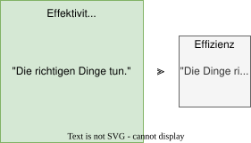

---
format:
  html:
    embed-resources: true
lang: de
bibliography: Literatur.bib
---

<!--
headlines:
  off: true
extended-content:
  off: false
included-content:
  off: false
worksheets:
  off: true
-->

<!--
title: "DEB Produktentwicklung"
format:
  html:
    embed-resources: true

author:
  - name: "Christian Anders"
    degrees: 
    roles: "Dozent"
    email: christian.anders@hs-esslingen.de
    affiliation: 
      - name: "Hochschule Esslingen"
        department: "Wirtschaft & Technik"
        group: "Digital Engineering (DEB)"
        city: "Esslingen am Neckar"
        postal-code: 73728
        country: "Deutschland"
        url: https://www.hs-esslingen.de/
abstract: > 
  Skript zur Vorlesung und Labor *"Produktentwicklung"* für den Studiengang Digital Engineering DEB
keywords:
  - Produktentstehungsprozess
  - Wirtschaftlichkeit
  - Effektivität
  - Effizienz

copyright: 
  holder: Christian Anders
  year: 2025
lang: de
bibliography: Literatur.bib
date: last-modified
toc: true
number-sections: true
scrollable: true
toc-location: right
cap-location: bottom
number-offset: 2
link-external-icon: true
link-external-newwindow: true
-->

<!--
number-offset: 
0 Grundlagen
1 Ideenfindung und Konzeptentwicklung
2 Entwurfs- und Entwicklungsphase
3 Prototyping und Test
4 Produktionsplanung und Produktion
5 Softskills
6 Literatur 
7 Anhang
-->

<!-- -------------------------------------------------------------------------

                       Wirtschaftlichkeit, Effektivität und Effizienz

-------------------------------------------------------------------------- -->

::: {.content-visible unless-meta="headlines.off"}
# Grundlagen
## Begriffe
:::

### Wirtschaftlichkeit, Effektivität, Effizienz

<!-- --------------------------------------------------------------------------
EXTENDED CONTENT  -  EXTENDED CONTENT  -  EXTENDED CONTENT  -  EXTENDED CONTENT
S T A R T -->
::: {.content-visible unless-meta="extended-content.off"}
<!-- ---------------------------------------------------------------------- -->

::: {.callout-tip}
## Definition: *"Wirtschaftlichkeit"*
[Wirtschaftlichkeit](https://de.wikipedia.org/wiki/Wirtschaftlichkeit) ist ein Wirtschaftssystem- und unternehmenszielindifferenter Ausdruck dafür, inwieweit eine Tätigkeit dem [Wirtschaftlichkeitsprinzip](https://de.wikipedia.org/wiki/%C3%96konomisches_Prinzip) genügt.
:::

::: {.callout-tip}
## Definition: *"Wirtschaftlichkeitsprinzip"*
Das Wirtschaftlichkeitsprinzip ist in den Wirtschaftswissenschaften eine wirtschaftliche Ausprägung des Rationalprinzips und bezeichnet die Rationalitätsannahme, dass Wirtschaftssubjekte aufgrund der Knappheit der Güter bei wirtschaftlichen Interaktionen die eingesetzten Mittel mit dem Ergebnis ins Verhältnis setzen und nach ihren subjektiven Präferenzen durch zweckrationales Handeln eine Nutzenmaximierung (Privathaushalte) beziehungsweise Gewinnmaximierung (bei Unternehmen) anstreben. Das Wirtschaftlichkeitsprinzip ist eine der Annahmen, auf denen das Modell des Homo Oeconomicus basiert.
:::

<!-- ---------------------------------------------------------------------- -->
:::
<!-- S T O P
EXTENDED CONTENT  -  EXTENDED CONTENT  -  EXTENDED CONTENT  -  EXTENDED CONTENT
--------------------------------------------------------------------------- -->

::: {.callout-tip}
## Definition: *"Effektivität"*
[Effektivität](https://de.wikipedia.org/wiki/Effektivit%C3%A4t) beschreibt den Grad der Zielerreichung (Wirksamkeit, Qualität der Zielerreichung), beim [Maximalprinzip](https://de.wikipedia.org/wiki/%C3%96konomisches_Prinzip#Maximalprinzip):

$$
Effektivität = \frac{Erreichtes \space Ist(-Ergebnis)}{Angestrebtes \space Soll(-Ergebnis)}
$$

Im Deutschen wird dies oft übersetzt mit: **Effektivität: *"Die richtigen Dinge tun."***
:::

Effektiv ist jede Tätigkeit, die zum Ziel führt, ungeachtet der Relation zwischen Ergebnis und hierfür erforderlichem Aufwand.

::: {.callout-tip}
## Definition: *"Effizienz"*
Effizienz ist ein Maß für die Wirtschaftlichkeit (Kosten-Nutzen-Relation). 

$$
Effizienz = \frac{Erreichtes \space Ist(-Ergebnis)}{Mitteleinsatz}
$$

Im Deutschen wird dies oft übersetzt mit: **Effizienz: *"Die Dinge richtig tun."***, im Zusammenhang mit Mitarbeitenden manchmal auch mit *"Leistungsfähigkeit"*.
:::

Eine insbesondere in der englischsprachigen betriebswirtschaftlichen Literatur häufige Unterscheidung zwischen Effectiveness (*"Wirksamkeit"*) und Efficiency (*"Effizienz"*) geht auf [Peter F. Drucker](https://de.wikipedia.org/wiki/Peter_Drucker) zurück.

---

>
*"It is fundamentally the confusion between effectiveness and efficiency that stands between doing the right things and doing things right. **There is surely nothing quite so useless as doing with great efficiency what should not be done at all."*** ([Peter F. Drucker](https://de.wikipedia.org/wiki/Peter_Drucker))

>
*"Effektivität ist, das Richtige zu tun. Effizienz ist, die Dinge richtig zu tun."* ([Peter F. Drucker](https://de.wikipedia.org/wiki/Peter_Drucker))

---

{width=60% #fig-effektivitaetvseffizienz}

::: {.callout-important}
## Pro-Tipp!
Einer der kritischen Erfolgsfaktoren bei der Produktentwicklung ist es richtig zu entscheiden, welches die Dinge sind, die getan werden müssen. Eine Fehlentscheidung bei den Dingen, die getan werden müssen, und auch noch so effizientes Handeln danach kann das Produktentwicklungsprojekt nicht mehr retten (siehe → "Rule of 10" der Fehlerkosten @sec-rule-of-10). Der geneigte Leser sei hiermit dringend angehalten sich stets die notwendige Zeit für die Entscheidung zu nehmen, welches die richtigen Dinge sind, die getan werden müssen, und hierfür auch Hilfe und Unterstützung in Anspruch zu nehmen.
:::

---

>
*"If it doesn't work, it doesn't matter how fast it doesn't work."* (Mich Ravera) 

>
*"Weeks of coding can save you hours of planning."* (Quelle: Unbekannt) 

---

---

>
*"The executive is, first of all, expected to get the right things done. And this is simply saying that he is expected to be effective. For manual work, we need only efficiency; that is, the ability to do things right rather than the ability to get the right things done. The manual worker can always be judged in terms of the quantity and quality of a definable and discrete output."* (Peter F. Drucker)

---

::: {.callout-important}
## Pro-Tipp!
In der der Produktentwicklung nachfolgenden Phase der Produktion (inkl. indirekter Bereiche wie z.B. der Anlageninstandhaltung) nimmt die Bedeutung Effizienz, ausgedrückt in der Fähigkeit, die dann bereits festgelegten Dinge, die getan werden müssen, richtig, nämlich effizient zu tun, zu und wird oftmals zum für die Wirtschaftlichkeit der Produktion des zuvor entwickelten Produkts zum entscheidenden Erfolgsfaktor.  
:::

<!--
Effizient ist jeder Erfolg, der dem [ökonomischen Prinzip](https://de.wikipedia.org/wiki/%C3%96konomisches_Prinzip) entspricht. Effizienz bedeutet demnach, mit gegebenem Aufwand ein maximales Ergebnis zu erzielen (Maximalprinzip) oder ein bestimmtes Ergebnis mit minimalem Aufwand zu erzielen (Minimalprinzip). Jede andere Art, einen Erfolg zu erreichen, ist auch effektiv, aber nicht unbedingt effizient. Wenn Effizienz vorliegt, liegt auch stets Effektivität vor, nicht aber umgekehrt.
-->

Im Gegensatz zur Effizienz, die in der Praxis nach Umsetzung einzelner Maßnahmen zumeist relativ einfach und zuverlässig gemessen werden (siehe z.B. → KPIs @sec-kpi) kann ist die Messung der Effektivität einzelner Maßnahme insbesondere im Vorfeld in der Praxis in der Regel nur mit hohem Aufwand und unter dem Treffen von mit Unsicherheiten behafteten Annahmen und mit dennoch bestehend bleibender Unsicherheit möglich. In der Praxis erscheint daher die Messung und die Konzentration auf Maßnahmen zur Steigerung der Effizienz oftmals attraktiver als der Versuch, die Effektivität von Maßnahmen im Vorfeld abzuschätzen. Das Management in Unternehmen fokusiert daher häufig auf die Steigerung der Effizienz als auf die Steigerung der Effektivität. 

::: {.callout-tip}
## tl;dr: 
Das (häufig betriebswirtschaftlich geprägte) Management in Unternehmen fokusiert oftmals bevorzugt auf die vergleichsweise einfache und gut messbare Steigerung der Effizienz (siehe z.B. → KPIs @sec-kpi) als auf die oftmals komplexere und schwer zu messende Steigerung der Effektivität.
:::

<!--

>*"Hobby ist der Versuch mit einem Maximum an Aufwand ein Minimum an Nutzen zu erzielen"* (Quelle: Unbekannt)

-->

<!--
## Notizen aus GEMINI AI

### Effizienz und Effektivität
Der Unterschied zwischen Effizienz und Effektivität ist ein häufiges Thema, aber er ist entscheidend für das Verständnis von Erfolg in vielen Bereichen, sei es im Privatleben oder im Berufsleben.
Hier ist die einfache Erklärung:
 * Effektivität: Bedeutet, die richtigen Dinge zu tun. Es geht darum, ob du dein Ziel überhaupt erreichst und ob das, was du tust, den gewünschten "Effekt" hat.
   * Frage: Erreiche ich mein Ziel? Tue ich das, was wirklich wichtig ist?
   * Beispiel in der Fotografie: Du möchtest ein atemberaubendes Landschaftsfoto mit einem dramatischen Sonnenuntergang machen. Wenn du zur richtigen Zeit am richtigen Ort bist und eine Komposition findest, die die Schönheit einfängt, bist du effektiv. Das Ziel – ein tolles Sonnenuntergangsbild – wurde erreicht.
 * Effizienz: Bedeutet, die Dinge richtig zu tun. Es geht darum, wie du dein Ziel mit möglichst wenig Aufwand, Zeit oder Ressourcen erreichst. Es ist die Frage der Wirtschaftlichkeit.
   * Frage: Wie mache ich es am besten? Tue ich es mit dem geringsten Aufwand/Kosten/Zeit?
   * Beispiel in der Fotografie: Du hast die Idee für das atemberaubende Landschaftsfoto. Wenn du die Belichtungseinstellungen schnell und präzise anpasst, die Kamera zügig aufbaust und die Nachbearbeitung effizient durchführst, um das Bild schnell fertigzustellen, bist du effizient. Du hast dein Ziel mit minimalem Zeit- und Ressourceneinsatz erreicht.
Zusammenfassend:
 * Effektivität = Zielerreichung (Das was zählt)
 * Effizienz = Ressourcenschonung (Das wie zählt)
Der Zusammenhang:
Ideal ist es, wenn man sowohl effektiv als auch effizient ist.
 * Du kannst effizient sein, aber nicht effektiv, wenn du Dinge sehr gut machst, die aber am Ende nicht zum gewünschten Ziel führen.
 * Du kannst effektiv sein, aber nicht effizient, wenn du dein Ziel erreichst, dafür aber viel zu viel Zeit, Geld oder Mühe investierst. 

### Effektivität in der Produktentwicklung
Das ist ein sehr wichtiger und treffender Punkt, den du da ansprichst! Deine Beobachtung ist absolut korrekt, wenn wir über die Messung der tatsächlichen Effektivität eines fertigen Produkts oder einer abgeschlossenen Maßnahme sprechen.
Effektivitätsmessung: Oft erst nach der Umsetzung
Die Methode, die ich beschrieben habe (Ziel definieren, Indikatoren festlegen, Daten sammeln, analysieren), ist klassisch für die nachträgliche Bewertung der Effektivität eines Outputs oder Outcomes. Du hast Recht:
 * Du musst ein Produkt haben, um dessen Wirkung messen zu können (z.B. Umsatzsteigerung durch Produkt X).
 * Du musst eine Maßnahme durchgeführt haben, um zu sehen, ob sie ihr Ziel erreicht hat (z.B. eine Marketingkampagne).
In diesem Sinne ist die von mir beschriebene Methode tatsächlich eher eine retrospektive oder evaluative Messung. Sie bewertet, ob das, was du getan oder geschaffen hast, nach seiner Fertigstellung die gewünschte Wirkung erzielt hat.
Aber was ist während der Entwicklung?
Genau hier liegt die Herausforderung und der Übergang zu anderen Konzepten. Während der Produktentwicklung oder vor der vollständigen Umsetzung einer Maßnahme geht es weniger um die reine "Effektivität" im Sinne des Endergebnisses, sondern um:
 * Validierung: Baust du das richtige Produkt? Löst es ein tatsächliches Problem? Hier geht es um Dinge wie Kundenbefragungen, Prototypen-Tests, MVP (Minimum Viable Product)-Tests – also Feedbackschleifen, um frühzeitig zu prüfen, ob du auf dem richtigen Weg bist.
 * Progress Measurement: Wie weit bist du in der Entwicklung? Hältst du den Zeitplan ein? Bleibst du im Budget? Das sind oft Effizienz-Kennzahlen (Ressourceneinsatz) oder Fortschrittsindikatoren (Anzahl der erledigten Aufgaben, erreichte Meilensteine).
 * Risikomanagement: Welche potenziellen Probleme könnten die spätere Effektivität beeinträchtigen? Wie kannst du diese frühzeitig erkennen und minimieren?
Man könnte sagen, dass die Messung von Effektivität, wie von mir beschrieben, der "Lackmustest" am Ende des Prozesses ist, um zu sehen, ob alles funktioniert hat. Die Schritte während der Entwicklung sind eher dazu da, die Wahrscheinlichkeit der späteren Effektivität zu maximieren und zu verhindern, dass man ein Produkt entwickelt, das am Ende niemand braucht oder das kein Ziel erreicht.
Dein Punkt ist also absolut entscheidend für das Verständnis des Unterschieds zwischen der Bewertung nach Fertigstellung und den Messungen während des Entwicklungsprozesses.
Was genau möchtest du also messen oder bewerten, wenn sich das Produkt noch in der Entwicklung befindet? Geht es dir darum, den Fortschritt oder die Wahrscheinlichkeit des Erfolgs zu messen?

Absolut, das ist ein vielschichtiges und spannendes Thema! Wenn es darum geht, die Wahrscheinlichkeit des späteren Erfolgs eines Produkts, einer Dienstleistung oder einer Initiative bereits während der Entwicklungsphase zu messen, bewegen wir uns weg von der reinen Effektivitätsmessung eines fertigen Ergebnisses hin zur Validierung und Prognose.
Hier geht es darum, fundierte Annahmen zu treffen und diese so früh und kostengünstig wie möglich zu testen, um das Risiko eines Fehlschlags zu minimieren. Wir sprechen hier über Konzepte, die stark im Lean Startup und in der agilen Entwicklung verwurzelt sind.
Wahrscheinlichkeit für den späteren Erfolg messen – die Phasen der Validierung
Man kann die Messung der Erfolgswahrscheinlichkeit in verschiedene Phasen unterteilen, die jeweils unterschiedliche Fragen beantworten:
1. Problem-Lösungs-Fit (Verstehe ich das Problem richtig und biete ich die richtige Lösung an?)
In dieser ganz frühen Phase geht es darum zu verstehen, ob es überhaupt ein relevantes Problem gibt und ob deine vorgeschlagene Lösung dieses Problem tatsächlich adressiert.
 * Was wird gemessen/validiert?
   * Existenz und Relevanz des Problems: Haben Menschen dieses Problem wirklich? Wie groß ist es für sie?
   * Akzeptanz der Lösungsidee: Würden potenzielle Nutzer deine Lösung nutzen? Sehen sie einen Wert darin?
   * Zahlungsbereitschaft (falls zutreffend): Wären sie bereit, dafür zu zahlen?
 * Wie wird gemessen (Methoden)?
   * Kundeninterviews: Qualitative Gespräche mit der Zielgruppe, um Probleme und Bedürfnisse zu ergründen.
   * Landing Pages / Mockups mit Call-to-Action: Eine einfache Webseite, die das Produkt beschreibt und eine Vorregistrierung oder Interessenbekundung abfragt (z.B. "Erfahren Sie mehr" oder "Jetzt vormerken"). Die Klickraten und Anmeldungen sind Indikatoren für Interesse.
   * Umfragen: Quantitative Erfassung von Präferenzen und Problemen bei einer größeren Gruppe.
   * Concierge-MVP: Manuell ausgeführte Dienstleistung, die später automatisiert werden soll, um frühzeitig echten Nutzerwert zu testen.
 * Indikatoren für Erfolgswahrscheinlichkeit: Hohes gemeldetes Problembewusstsein, hohe Zustimmung zur Lösungsidee, hohe Klick- und Anmelderaten.
2. Produkt-Markt-Fit (Wird mein Produkt von einer signifikanten Gruppe angenommen und löst ein echtes Bedürfnis?)
Hier geht es darum, eine erste, funktionsfähige Version des Produkts (oft ein Minimum Viable Product - MVP) in die Hände von Nutzern zu geben und deren Verhalten zu beobachten.
 * Was wird gemessen/validiert?
   * Nutzungsrate & Engagement: Wird das Produkt tatsächlich genutzt? Wie oft? Wie lange?
   * User Experience (UX): Ist es einfach zu bedienen? Macht es Spaß?
   * Retention (Kundenbindung): Kommen Nutzer zurück? Bleiben sie langfristig dabei?
   * Empfehlungsbereitschaft (Net Promoter Score - NPS): Würden Nutzer das Produkt weiterempfehlen?
   * Kern-KPIs des Produkts: Was sind die Schlüsselkennzahlen, die den Erfolg deines Produkts definieren (z.B. Anzahl erfolgreich abgeschlossener Transaktionen, Generierung von Leads, erzielte Einsparungen)?
 * Wie wird gemessen (Methoden)?
   * A/B-Tests: Vergleich verschiedener Versionen einer Funktion oder des Produkts, um zu sehen, welche besser performt.
   * Analysetools: Tools wie Google Analytics, Mixpanel, Hotjar, die Nutzerverhalten aufzeichnen (Klicks, Verweildauer, Absprungraten).
   * Nutzer-Feedback-Kanäle: Direkte Kanäle wie Support-Anfragen, Feedback-Buttons, App-Store-Bewertungen.
   * Usability-Tests: Beobachtung von Nutzern bei der Interaktion mit dem MVP.
   * Kohortenanalyse: Untersuchung des Verhaltens von Nutzergruppen über die Zeit.
 * Indikatoren für Erfolgswahrscheinlichkeit: Hohe Nutzungsfrequenz, gutes Engagement, geringe Abwanderung, positive Empfehlungen, Erreichen der Kern-KPIs.
3. Skalierbarkeit & Wirtschaftlichkeit (Kann das Produkt profitabel wachsen?)
Obwohl dies oft eine spätere Phase ist, können erste Annahmen und Messungen bereits frühzeitig Hinweise auf die spätere Skalierbarkeit geben.
 * Was wird gemessen/validiert?
   * Akquisitionskosten (CAC - Customer Acquisition Cost): Wie teuer ist es, einen neuen Kunden zu gewinnen?
   * Customer Lifetime Value (CLV): Welchen Wert bringt ein Kunde über seine gesamte Nutzungsdauer?
   * Margen: Wie viel Gewinn bleibt pro verkaufter Einheit übrig?
 * Wie wird gemessen (Methoden)?
   * Kleine Marketing-Tests: Ausführen von Testkampagnen mit geringem Budget, um erste CPA-Werte (Cost-per-Acquisition) zu erhalten.
   * Preistests: Testen verschiedener Preismodelle mit kleinen Nutzergruppen.
   * Kosten-Nutzen-Analyse von Prototypen: Grobe Schätzung der Produktionskosten vs. potenzieller Einnahmen.
 * Indikatoren für Erfolgswahrscheinlichkeit: CAC ist deutlich niedriger als CLV, positive Margen, Bestätigung des Geschäftsmodells.
Dein Beitrag als Fotograf: Datenvisualisierung
Gerade bei diesen Validierungsschritten kann deine Leidenschaft für Fotografie indirekt eine Rolle spielen. Nicht im Sinne von künstlerischen Fotos, aber im Sinne der Visualisierung von Daten. Aussagekräftige Grafiken, Infografiken oder sogar kurze Videos, die Nutzerinteraktionen zeigen, können helfen, die gesammelten Daten und die daraus abgeleiteten Erkenntnisse verständlicher und überzeugender zu präsentieren.
Zusammenfassend lässt sich sagen, dass die Messung der Wahrscheinlichkeit für den späteren Erfolg ein iterativer Prozess ist, bei dem man ständig Hypothesen aufstellt, testet und lernt. Es geht darum, Unsicherheiten zu reduzieren, bevor man große Investitionen tätigt.
Gibt es einen bestimmten Aspekt dieser Phasen, der dich besonders interessiert, oder ein konkretes Beispiel, bei dem du dir vorstellen könntest, diese Prinzipien anzuwenden?

-->