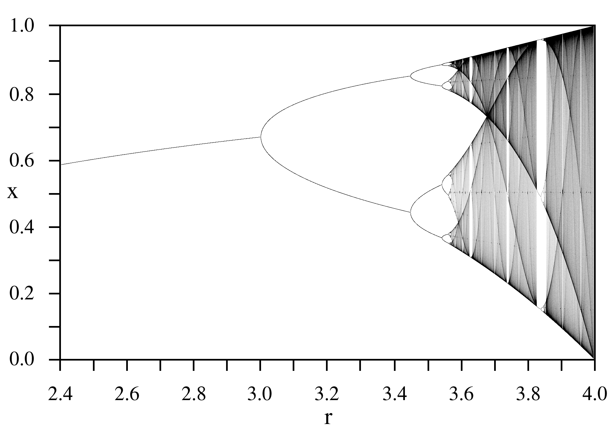
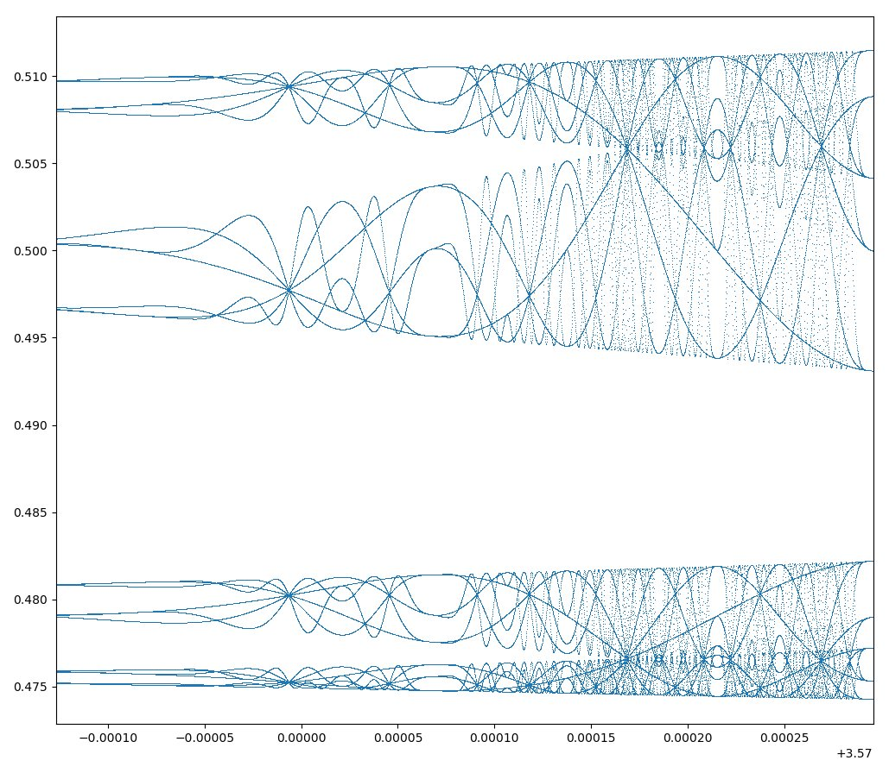

### Logistische Gleichung

Die [Logistische Gleichung](https://de.wikipedia.org/wiki/Logistische_Gleichung) ist ein heute weithin bekanntes und extrem einfaches Beispiel dafür, wie komplexes, chaotisches Verhalten bereits aus sehr einfachen nichtlinearen Gleichungen entstehen kann. 

Die logistische Gleichung wurde bereits 1837 von [Pierre François Verhulst](https://de.wikipedia.org/wiki/Pierre-Fran%C3%A7ois_Verhulst) als demographisches mathematisches Modell eingeführt, jedoch fand sie erst in der Folge einer richtungsweisenden Arbeit des theoretischen Biologen [Robert May](https://de.wikipedia.org/wiki/Robert_May) aus dem Jahr 1976 weite Verbreitung und Aufmerksamkeit.

Logistische Gleichung:

$$
X_{n+1}=r⋅X_n ​⋅ (1-X_n)
$$

mit *Reproduktionsrate* $r$ [0;4] und der *Population* zum Start $X_0$ [0;1].

::: {.callout-note}
## Logistische Gleichung (Dauer 10 min)
**Aufgabe:**

**a)** Bitte berechnen Sie näherungsweise den Wert für $X_{\infty}$ für $r = 2.0$ und $X_0 = 0.1$.

**b)** Bitte berechnen Sie näherungsweise den Wert für $X_{\infty}$ für $r = 3.2$ und $X_0 = 0.1$.

**c)** Bitte berechnen Sie näherungsweise den Wert für $X_{\infty}$ für $r = 3.8$ und $X_0 = 0.1$.
:::

 {width=16%} → Excel-Worksheet *"Logistische Gleichung"*

+ [Logistische Gleichung](https://de.wikipedia.org/wiki/Logistische_Gleichung)
+ [Video - praktische Bedeutung der Logistische Gleichung](https://youtu.be/ovJcsL7vyrk?si=r2ceLreNqAFIBK2T)

::: {.content-visible when-profile="wip-profile"}
::: {.callout-tip collapse="true"}
## Feigenbaum-Diagramm Lösung

**a)** $X_{\infty}$ für $r = 2.0$ und $X_0 = 0.1$ → Stabile Population: $0.5$.

**b)** $X_{\infty}$ für $r = 3.2$ und $X_0 = 0.1$ → Oszillierende Population: $0.513$ und $0.799$.

**c)** $X_{\infty}$ für $r = 3.8$ und $X_0 = 0.1$ → Stark und ohne erkennbares Muster fluktuierende Population (siehe → @fig-bifurcation "Feigenbaum-Diagramm").

{width=80% #fig-bifurcation}

<!--
{width=80% #fig-bifurcation}
-->
:::
:::